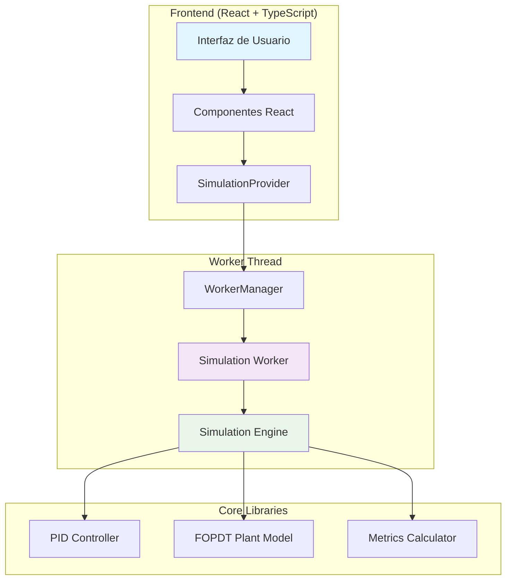
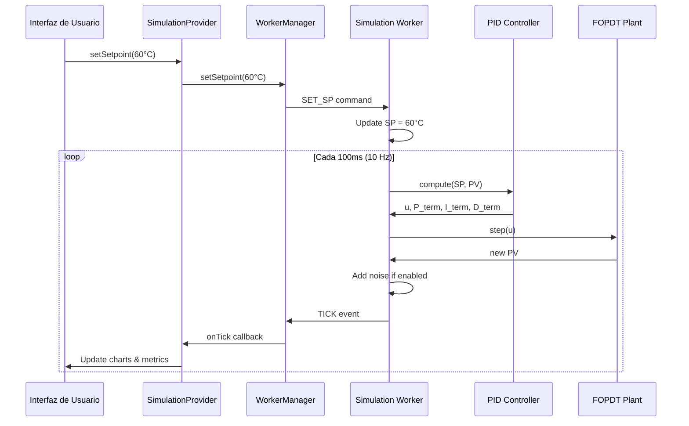

# 🎛️ PID Playground


[](https://reactjs.org/)
[](https://www.typescriptlang.org/)
[](https://vitejs.dev/)
[](https://tailwindcss.com/)
[](https://ui.shadcn.com/)
[](https://recharts.org/)
[](https://opensource.org/licenses/MIT)
[](https://vitest.dev/)
[](https://vitest.dev/guide/coverage.html)

> **PID Playground - Simulador PID Industrial en Tiempo Real** - Una aplicación web avanzada para simular y analizar sistemas de control térmico usando controladores PID con modelo FOPDT.

## 🎯 Características Principales

### 🎛️ Control PID Industrial
- **Controlador PID posicional** con anti-windup y derivada filtrada
- **Back-calculation** para prevenir saturación integral
- **Derivada sobre PV** para evitar kick derivativo
- **Parámetros ajustables** en tiempo real (Kp, Ki, Kd, N, Tt)
- **Presets predefinidos** (Conservador, Balanceado, Agresivo)

### 🌡️ Modelo FOPDT Avanzado
- **Discretización exacta** matemáticamente para estabilidad garantizada
- **Tiempo muerto variable** con buffer circular eficiente
- **Modos Horno/Chiller** configurables
- **Temperatura ambiente** ajustable
- **Simulación en tiempo real** a 10 Hz

### 📊 Visualización y Análisis
- **Gráficas en tiempo real** con Recharts
- **Métricas automáticas** (Overshoot, Settling Time, Peak Time)
- **Ventanas de tiempo** configurables (30s, 1min, 5min)
- **Exportación CSV** con metadatos completos
- **Interfaz responsive** con tema industrial

### ⚡ Performance y Robustez
- **Web Workers** para simulación paralela
- **Buffer circular** eficiente para datos históricos
- **Manejo robusto de errores** con recuperación automática


## 🚀 Demo en Vivo

**[🌐 Ver Demo Online](https://pid-playground-demo.vercel.app)**

## 📦 Instalación

### Prerequisitos
- **Node.js** 18+ 
- **pnpm** (recomendado) o npm

### Instalación Rápida

```bash
# Clonar el repositorio
git clone https://github.com/triptalabs/pid-playground.git
cd pid-playground

# Instalar dependencias
pnpm install

# Iniciar servidor de desarrollo
pnpm dev
```

La aplicación estará disponible en `http://localhost:8080`

### Scripts Disponibles

```bash
pnpm dev          # Servidor de desarrollo
pnpm build        # Build de producción
pnpm preview      # Previsualizar build
pnpm test         # Ejecutar tests
pnpm test:coverage # Tests con cobertura
pnpm lint         # Linter y formateo
```

## 🏗️ Arquitectura del Sistema

### Diagrama de Arquitectura



### Flujo de Datos



## 🎮 Uso Rápido

### 1. Configuración Inicial
```typescript
// Preset recomendado para horno industrial
const hornoConfig = {
  mode: 'horno',
  setpoint: 60,
  pid: { kp: 2.0, ki: 0.1, kd: 10 },
  plant: { k: 8.0, tau: 60, l: 5, t_amb: 25 }
}
```

### 2. Control de Simulación
- **Start/Pause**: Botón principal o tecla `S`
- **Reset**: Botón reset o tecla `R`
- **Setpoint**: Controles deslizantes o flechas ↑↓
- **Ventana de tiempo**: Flechas ←→

### 3. Análisis de Respuesta
- **Overshoot**: Porcentaje de sobreimpulso
- **Settling Time**: Tiempo de establecimiento
- **Peak Time**: Tiempo al pico máximo
- **Steady State Error**: Error en estado estacionario

## 📚 Documentación Completa

### 🎯 Para Usuarios
- **[Guía de Inicio](./docs/user-guide/getting-started.md)** - Primeros pasos en 5 minutos
- **[Tutorial Básico](./docs/user-guide/tutorials/01-basic-pid.md)** - Conceptos PID fundamentales
- **[Tutorial de Sintonización](./docs/user-guide/tutorials/02-tuning.md)** - Optimización de parámetros
- **[FAQ](./docs/user-guide/faq.md)** - Preguntas frecuentes

### 🔧 Para Desarrolladores
- **[Arquitectura](./docs/technical/architecture.md)** - Diseño del sistema
- **[API Reference](./docs/technical/api-reference.md)** - Interfaces y APIs
- **[Guía de Desarrollo](./docs/technical/development.md)** - Configuración y desarrollo
- **[Despliegue](./docs/technical/deployment.md)** - Instalación y configuración

### 📐 Para Especialistas
- **[Teoría PID](./docs/mathematical/theory/pid.md)** - Fundamentos matemáticos
- **[Modelo FOPDT](./docs/mathematical/theory/fopdt.md)** - Teoría de la planta
- **[Validación](./docs/mathematical/validation/)** - Tests y validación
- **[Análisis](./docs/mathematical/analysis/)** - Métricas y optimización

## 🛠️ Stack Tecnológico

| Área | Tecnología | Versión | Propósito |
|------|------------|---------|-----------|
| **Frontend** | React + TypeScript | 18.3.1 | UI principal |
| **Build** | Vite | 5.4.19 | Bundler y dev server |
| **UI Components** | shadcn/ui + Radix UI | Latest | Componentes accesibles |
| **Styling** | Tailwind CSS | 3.4.17 | Estilos y tema |
| **Charts** | Recharts | 2.15.4 | Visualización de datos |
| **State Management** | React Context + Hooks | Built-in | Estado global |
| **Workers** | Web Workers | Native | Simulación paralela |
| **Testing** | Vitest | 3.2.4 | Unit testing |
| **Linting** | ESLint + TypeScript | Latest | Calidad de código |


## 🎯 Casos de Uso

### 🏭 Industria
- **Sintonización de hornos industriales**
- **Análisis de sistemas de control térmico**
- **Validación de parámetros PID antes de implementación**
- **Entrenamiento de operadores**

### 🎓 Educación
- **Enseñanza de control automático**
- **Experimentación con diferentes configuraciones**
- **Visualización de conceptos PID**
- **Análisis de respuesta del sistema**

### 🔬 Investigación
- **Validación de algoritmos de control**
- **Análisis de estabilidad**
- **Optimización de parámetros**
- **Comparación de estrategias de control**

## 🚀 Roadmap

### ✅ Completado (v1.0.0)
- [x] Controlador PID industrial completo
- [x] Modelo FOPDT con discretización exacta
- [x] Interfaz web responsive
- [x] Simulación en tiempo real
- [x] Métricas automáticas
- [x] Exportación de datos
- [x] Tests unitarios completos
- [x] Documentación técnica

### 🔄 En Desarrollo (v1.1.0)
- [ ] Múltiples plantas simultáneas
- [ ] Algoritmos de sintonización automática
- [ ] Análisis de frecuencia
- [ ] Modo batch para análisis offline
- [ ] API REST para integración

### 🚀 Próximas Versiones
- [ ] Control predictivo (MPC)
- [ ] Lógica difusa (Fuzzy Logic)
- [ ] Integración IoT
- [ ] Machine Learning para optimización
- [ ] Soporte multi-idioma

## 🤝 Contribuir

### 🐛 Reportar Problemas
1. Buscar en [issues existentes](https://github.com/triptalabs/pid-playground/issues)
2. Crear nuevo issue con template apropiado
3. Incluir pasos para reproducir y logs

### 💡 Sugerir Mejoras
1. Crear issue con etiqueta `enhancement`
2. Describir caso de uso y beneficio
3. Proponer implementación si es posible

### 🔧 Contribuir Código
1. Fork del repositorio
2. Crear branch para feature/fix
3. Implementar cambios con tests
4. Ejecutar `pnpm test` y `pnpm lint`
5. Crear Pull Request

### 📋 Guías de Contribución
- **[Guía de Desarrollo](./docs/technical/development.md)**
- **[Estándares de Código](./docs/technical/coding-standards.md)**
- **[Proceso de PR](./docs/technical/pull-request-process.md)**

## 📄 Licencia

Este proyecto está licenciado bajo la **MIT License** - ver el archivo [LICENSE](LICENSE) para detalles.

## 📞 Soporte

- **[FAQ](./docs/user-guide/faq.md)** - Preguntas frecuentes
- **[Guía de Inicio](./docs/user-guide/getting-started.md)** - Primeros pasos
- **[Issues de GitHub](https://github.com/triptalabs/pid-playground/issues)** - Reportar problemas


---

<div align="center">

**¿Te gusta este proyecto? ¡Dale una ⭐ en GitHub!**

[](https://github.com/triptalabs/pid-playground)
[](https://github.com/triptalabs/pid-playground)
[](https://github.com/triptalabs/pid-playground/issues)
[](https://github.com/triptalabs/pid-playground/pulls)

*Desarrollado con ❤️ para la comunidad de control automático*

</div>
