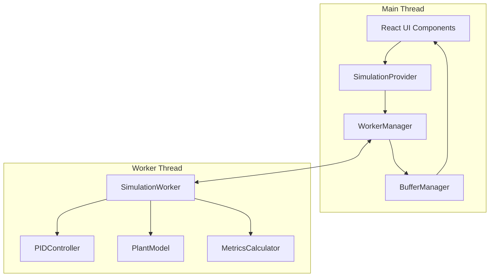

# Arquitectura y Contrato de Mensajes UI ↔ Worker

## 1. Vista General de la Arquitectura

### 1.1 Patrón Arquitectónico
La aplicación sigue el patrón **Actor Model** con separación clara entre:
- **UI Thread**: Renderizado, interacciones de usuario, visualización
- **Worker Thread**: Simulación, cálculos matemáticos, procesamiento de datos
- **Message Bus**: Comunicación tipada y asíncrona entre threads

### 1.2 Componentes Principales



### 1.3 Flujo de Datos

1. **Usuario interactúa** → UI Components
2. **UI actualiza estado** → SimulationProvider  
3. **Provider envía comando** → WorkerManager
4. **Manager serializa** → Worker via MessagePort
5. **Worker procesa** → Simulation Engine
6. **Engine calcula** → PID + Plant + Metrics
7. **Worker emite resultados** → Manager via MessagePort
8. **Manager deserializa** → BufferManager
9. **Buffer actualiza** → UI via Context

## 2. Contrato de Mensajes Detallado

### 2.1 Tipos Base

```typescript
// Identificadores de mensaje
type MessageType = 
  // Control de simulación
  | 'INIT' | 'START' | 'PAUSE' | 'RESET'
  // Configuración de parámetros  
  | 'SET_PID' | 'SET_PLANT' | 'SET_SP' | 'SET_NOISE' | 'SET_SSR'
  // Acciones dinámicas
  | 'ADD_DISTURBANCE' | 'APPLY_PRESET' | 'SET_WINDOW'
  // Respuestas del Worker
  | 'TICK' | 'METRICS' | 'STATE' | 'ERROR' | 'READY'

// Estructura base de mensaje
interface BaseMessage {
  id: string          // UUID para correlación request/response
  type: MessageType
  timestamp: number   // performance.now()
}

// Mensaje de comando (UI → Worker)
interface CommandMessage extends BaseMessage {
  payload: unknown
}

// Mensaje de evento (Worker → UI)  
interface EventMessage extends BaseMessage {
  payload: unknown
}
```

### 2.2 Mensajes UI → Worker

#### 2.2.1 Control de Simulación

```typescript
// Inicialización del Worker
interface InitCommand extends CommandMessage {
  type: 'INIT'
  payload: {
    timestep: number      // T_s en segundos (default: 0.1)
    bufferSize: number    // Tamaño máximo del buffer
    debugMode: boolean    // Habilitar logs detallados
  }
}

// Iniciar simulación
interface StartCommand extends CommandMessage {
  type: 'START'
  payload: {}
}

// Pausar simulación (mantiene estado)
interface PauseCommand extends CommandMessage {
  type: 'PAUSE'  
  payload: {}
}

// Reset completo (estado inicial)
interface ResetCommand extends CommandMessage {
  type: 'RESET'
  payload: {
    preserveParams?: boolean  // Si true, solo resetea PV/estado, no parámetros
  }
}
```

#### 2.2.2 Configuración de Parámetros

```typescript
// Configurar ganancias PID
interface SetPIDCommand extends CommandMessage {
  type: 'SET_PID'
  payload: {
    kp: number           // Ganancia proporcional [adimensional]
    ki: number           // Ganancia integral [s⁻¹]  
    kd: number           // Tiempo derivativo [s]
    N?: number           // Factor filtro derivada (default: 10)
    Tt?: number          // Tiempo tracking anti-windup [s] (default: auto)
    enabled?: boolean    // Habilitar/deshabilitar PID (default: true)
  }
}

// Configurar modelo de planta  
interface SetPlantCommand extends CommandMessage {
  type: 'SET_PLANT'
  payload: {
    K: number           // Ganancia efectiva [°C/s por unidad u]
    tau: number         // Constante de tiempo [s]
    L: number           // Tiempo muerto [s]  
    T_amb: number       // Temperatura ambiente [°C]
    mode: 'horno' | 'chiller'  // Modo de operación
  }
}

// Configurar setpoint
interface SetSPCommand extends CommandMessage {
  type: 'SET_SP'
  payload: {
    value: number       // Setpoint en °C
    rampRate?: number   // Velocidad de rampa [°C/s] (default: instantáneo)
  }
}

// Configurar ruido
interface SetNoiseCommand extends CommandMessage {
  type: 'SET_NOISE'
  payload: {
    enabled: boolean    // Habilitar ruido
    sigma: number       // Desviación estándar [°C]
    seed?: number       // Semilla para reproducibilidad (default: random)
  }
}

// Configurar SSR por ventana
interface SetSSRCommand extends CommandMessage {
  type: 'SET_SSR'  
  payload: {
    enabled: boolean    // Activar modulación SSR
    period: number      // Período de ventana [s]
    method: 'average' | 'toggling'  // Método de simulación
  }
}
```

#### 2.2.3 Acciones Dinámicas

```typescript
// Aplicar disturbio escalón
interface AddDisturbanceCommand extends CommandMessage {
  type: 'ADD_DISTURBANCE'
  payload: {
    amplitude: number   // Amplitud [°C/s]
    duration: number    // Duración [s]
    delay?: number      // Retardo desde ahora [s] (default: 0)
  }
}

// Aplicar preset de configuración
interface ApplyPresetCommand extends CommandMessage {
  type: 'APPLY_PRESET'
  payload: {
    key: 'horno_lento' | 'horno_medio' | 'chiller_compacto'
    resetScenario: boolean    // Si resetear simulación también
    preserveCurrentSP: boolean // Mantener SP actual
  }
}

// Configurar ventana temporal de visualización
interface SetWindowCommand extends CommandMessage {
  type: 'SET_WINDOW'
  payload: {
    seconds: 30 | 60 | 300    // Duración de ventana visible
  }
}
```

### 2.3 Mensajes Worker → UI

#### 2.3.1 Datos de Simulación

```typescript
// Datos de cada tick de simulación
interface TickEvent extends EventMessage {
  type: 'TICK'
  payload: {
    t: number              // Tiempo de simulación [s]
    SP: number             // Setpoint actual [°C]
    PV: number             // Process Variable (medida) [°C] 
    u: number              // Salida de control [0-1]
    PV_clean: number       // PV sin ruido [°C]
    error: number          // Error SP - PV [°C]
    
    // Componentes del PID
    P_term: number         // Término proporcional
    I_term: number         // Término integral  
    D_term: number         // Término derivativo
    
    // Estado de la planta
    plant_state: number    // Estado interno x = T - T_amb
    
    // Límites y saturación
    u_raw: number         // Salida PID antes de saturar
    saturated: boolean    // True si u está saturado
    
    // Información de ventana
    bounds: {
      t_min: number       // Tiempo mínimo en buffer
      t_max: number       // Tiempo máximo en buffer  
      PV_min: number      // PV mínimo en ventana
      PV_max: number      // PV máximo en ventana
    }
  }
}
```

#### 2.3.2 Métricas de Desempeño

```typescript
// Métricas calculadas
interface MetricsEvent extends EventMessage {
  type: 'METRICS'
  payload: {
    // Métricas principales
    overshoot: {
      value: number          // Overshoot en %
      valid: boolean         // Si el cálculo es válido
      peak_time: number      // Tiempo del pico [s]
      peak_value: number     // Valor del pico [°C]
    }
    
    settling_time: {
      value: number          // Tiempo de establecimiento [s]
      valid: boolean         // Si se alcanzó la banda
      band_percent: number   // Banda usada (default: 2%)
      hold_time: number      // Tiempo de hold requerido [s]
    }
    
    // Métricas adicionales (opcionales)
    steady_state_error: number    // Error en estado estacionario [°C]
    rise_time: number            // Tiempo de subida 10%-90% [s]
    
    // Métricas integrales (si están habilitadas)
    IAE?: number            // Integral Absolute Error
    ISE?: number            // Integral Squared Error  
    RMSE?: number           // Root Mean Square Error
    
    // Metadatos
    calculation_window: {
      start_time: number    // Inicio de ventana de cálculo [s]
      end_time: number      // Fin de ventana de cálculo [s]
      samples: number       // Número de muestras usadas
    }
    
    reference_SP: number    // SP de referencia para métricas
  }
}
```

#### 2.3.3 Estado y Control

```typescript
// Estado del Worker
interface StateEvent extends EventMessage {
  type: 'STATE'
  payload: {
    state: 'initializing' | 'ready' | 'running' | 'paused' | 'error'
    uptime: number          // Tiempo de ejecución [s]
    samples_processed: number // Total de muestras procesadas
    performance: {
      avg_cycle_time: number    // Tiempo promedio por ciclo [ms]
      max_cycle_time: number    // Tiempo máximo observado [ms]
      cpu_usage_estimate: number // Estimación de uso CPU [%]
    }
  }
}

// Evento de inicialización completa
interface ReadyEvent extends EventMessage {
  type: 'READY'
  payload: {
    version: string         // Versión del Worker
    capabilities: string[]  // Características soportadas
    limits: {
      max_timestep: number      // T_s máximo [s]
      min_timestep: number      // T_s mínimo [s]
      max_buffer_size: number   // Buffer máximo
    }
  }
}
```

#### 2.3.4 Errores y Warnings

```typescript
// Errores y advertencias
interface ErrorEvent extends EventMessage {
  type: 'ERROR'
  payload: {
    severity: 'warning' | 'error' | 'critical'
    code: string           // Código de error único
    message: string        // Mensaje human-readable
    details?: {
      parameter?: string   // Parámetro relacionado
      value?: unknown     // Valor que causó el error
      expected?: string   // Valor esperado
      context?: string    // Contexto adicional
    }
    
    // Información de debugging
    stack?: string        // Stack trace si aplica
    timestamp: number     // Timestamp del error
    
    // Sugerencias de corrección
    suggestions?: string[]
    
    // Si el error es recoverable
    recoverable: boolean
  }
}
```

## 3. Códigos de Error Estándar

### 3.1 Errores de Configuración
- `CFG_001`: Parámetro fuera de rango
- `CFG_002`: Combinación de parámetros inválida  
- `CFG_003`: Timestep inválido
- `CFG_004`: Modo de operación no soportado

### 3.2 Errores de Simulación
- `SIM_001`: Inestabilidad numérica detectada
- `SIM_002`: Overflow en cálculos
- `SIM_003`: Drift temporal excesivo
- `SIM_004`: Buffer overflow

### 3.3 Errores de Comunicación
- `COM_001`: Mensaje malformado
- `COM_002`: Timeout en comunicación
- `COM_003`: Tipo de mensaje no reconocido
- `COM_004`: Payload inválido

## 4. Garantías y Comportamiento

### 4.1 Idempotencia
- **SET_***: Reemplaza completamente el estado anterior
- **ADD_DISTURBANCE**: No idempotente, acumula disturbios
- **RESET**: No idempotente, limpia estado
- **APPLY_PRESET**: Puede o no resetear según flag

### 4.2 Frecuencias
- **TICK**: Exactamente 10 Hz durante simulación activa
- **METRICS**: Variable, típicamente cada 5-10 ticks o al cambiar SP
- **STATE**: Solo en cambios de estado
- **ERROR**: Inmediatamente al detectar

### 4.3 Orden de Mensajes
- **Garantizado**: Mensajes del mismo tipo se procesan en orden
- **No garantizado**: Mensajes de tipos diferentes pueden reordenarse
- **Correlación**: Usar field `id` para correlar request/response

### 4.4 Manejo de Errores
- **Errores críticos**: Worker se detiene, requiere reinicio
- **Errores recuperables**: Worker emite ERROR pero continúa
- **Warnings**: Worker emite ERROR severity=warning y continúa

### 4.5 Límites y Protecciones
- **Buffer overflow**: Worker limita automáticamente el tamaño
- **Parámetros extremos**: Clamps automáticos con warnings
- **Frecuencia excesiva**: Rate limiting en comandos
- **Memoria**: Garbage collection automático de buffers viejos

## 5. Implementación del Contrato

### 5.1 TypeScript Interfaces
```typescript
// Union type de todos los comandos
type SimulationCommand = 
  | InitCommand | StartCommand | PauseCommand | ResetCommand
  | SetPIDCommand | SetPlantCommand | SetSPCommand 
  | SetNoiseCommand | SetSSRCommand | AddDisturbanceCommand
  | ApplyPresetCommand | SetWindowCommand

// Union type de todos los eventos  
type SimulationEvent = 
  | TickEvent | MetricsEvent | StateEvent 
  | ReadyEvent | ErrorEvent

// Handler types para UI
type CommandHandler = (command: SimulationCommand) => void
type EventHandler = (event: SimulationEvent) => void
```

### 5.2 Validación
- **JSON Schema**: Validación automática de payloads
- **Runtime checks**: Validación de rangos y tipos  
- **Sanitization**: Limpieza de inputs potencialmente peligrosos

### 5.3 Serialización
- **JSON**: Protocolo base de comunicación
- **Structured cloning**: Para objetos complejos si es necesario
- **Compression**: Considerar para buffers grandes

### 5.4 Debugging
- **Message logging**: Registro completo en development mode
- **Performance metrics**: Medición de latencias
- **State inspection**: Capacidad de exportar estado completo

## 6. Evolución del Contrato

### 6.1 Versionado
- **Semantic versioning**: MAJOR.MINOR.PATCH para el contrato
- **Backward compatibility**: Mantener compatibilidad en versiones MINOR
- **Deprecation policy**: Al menos 2 versiones para deprecar fields

### 6.2 Extensibilidad
- **Optional fields**: Usar para nuevas características
- **Payload extensible**: Permitir campos adicionales
- **Capability negotiation**: Worker anuncia capacidades soportadas
