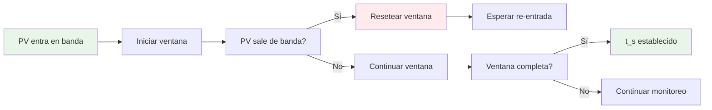
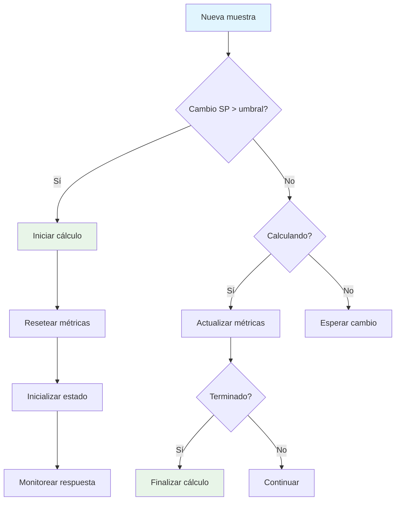
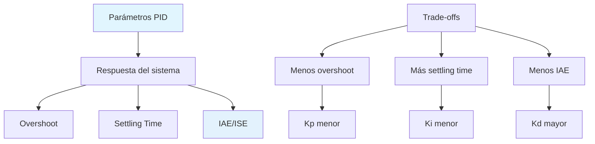

# Análisis de Métricas de Control PID

## 📖 Descripción General

El simulador PID calcula automáticamente métricas de rendimiento para evaluar la calidad del control. Estas métricas proporcionan información cuantitativa sobre la respuesta del sistema y ayudan en la sintonía del controlador.

> **📊 Estado Actual**: Las métricas básicas (overshoot, tiempo de pico, tiempo de establecimiento) están **implementadas** en el simulador. Los índices de rendimiento avanzados (IAE, ISE) son **mejoras propuestas** para próximas versiones.

## 📊 Métricas Principales

### 1. Overshoot (Sobreimpulso) ✅ **Implementado**

#### Definición Matemática

El overshoot es el pico máximo de la respuesta por encima del setpoint final:

```
OS% = ((PV_max - SP_final) / |SP_final|) × 100%
```

Donde:
- *PV_max* = Valor máximo de la variable de proceso
- *SP_final* = Setpoint final después del cambio

#### Implementación Actual

```typescript
private calculateOvershoot(sp: number, pv: number, t: number): void {
  if (sp === 0) {
    // Caso especial: SP = 0, usar overshoot absoluto
    if (pv > this.state.pv_max) {
      this.state.pv_max = pv
      this.state.overshoot = pv
      this.state.t_peak = t
    }
    return
  }

  // Overshoot coherente para pasos ascendentes y descendentes
  const direction = Math.sign(sp - this.state.sp_previous || 1)
  const error = pv - sp
  const signedOvershoot = (error / Math.abs(sp)) * 100

  if (direction < 0) {
    // Paso descendente: medir undershoot
    if (pv < this.state.pv_min) {
      this.state.pv_min = pv
    }
    const undershootPercent = -signedOvershoot
    if (undershootPercent > this.state.overshoot) {
      this.state.overshoot = undershootPercent
      this.state.t_peak = t
    }
  } else {
    // Paso ascendente: overshoot clásico
    if (pv > this.state.pv_max) {
      this.state.pv_max = pv
    }
    const overshootPercent = signedOvershoot
    if (overshootPercent > this.state.overshoot) {
      this.state.overshoot = overshootPercent
      this.state.t_peak = t
    }
  }
}
```

#### Visualización

```mermaid
graph TD
    A[Cambio SP] --> B[Detectar dirección]
    B --> C{SP aumenta?}
    C -->|Sí| D[Buscar máximo PV]
    C -->|No| E[Buscar mínimo PV]
    
    D --> F[Calcular overshoot]
    E --> G[Calcular undershoot]
    
    F --> H[OS% = (PV_max - SP)/SP × 100%]
    G --> I[US% = (SP - PV_min)/SP × 100%]
    
    style A fill:#e8f5e8
    style H fill:#e3f2fd
    style I fill:#e3f2fd
```

### 2. Tiempo de Pico (*t_peak*) ✅ **Implementado**

#### Definición

El tiempo de pico es el instante en que se alcanza el overshoot máximo:

```
t_peak = arg max_t |PV(t) - SP_final|
```

#### Características

- **Para pasos ascendentes**: Tiempo del máximo overshoot
- **Para pasos descendentes**: Tiempo del máximo undershoot
- **Indicador de velocidad**: Tiempos menores indican respuesta más rápida

### 3. Tiempo de Establecimiento (*t_s*) ✅ **Implementado**

#### Definición Matemática

El tiempo de establecimiento es el tiempo requerido para que la respuesta permanezca dentro de una banda de tolerancia del valor final:

```
t_s = min { t | |PV(τ) - SP_final| ≤ ε·|SP_final|, ∀τ ≥ t }
```

Donde *ε* = tolerancia (típicamente 2% o 5%)

#### Implementación Actual

```typescript
private calculateSettlingTime(sp: number, pv: number, t: number): void {
  if (sp === 0) return // No calcular para SP = 0

  const error_percent = Math.abs(pv - sp) / Math.abs(sp) * 100

  if (error_percent <= this.config.settling_threshold) {
    if (this.state.settling_time === 0) {
      // Primer momento dentro del umbral
      this.state.settling_time = t
    }
  } else {
    // Fuera del umbral, resetear
    this.state.settling_time = 0
  }
}
```

#### Ventana de Estabilidad



## 📈 Índices de Rendimiento 🚀 **Mejoras para Próximas Versiones**

### 1. IAE (Integral of Absolute Error)

#### Definición

```
IAE = ∫|e(t)|dt
```

#### Propuesta de Implementación

```typescript
function calculateIAE(error_samples: number[], timestep: number): number {
  return error_samples.reduce((sum, error) => {
    return sum + Math.abs(error) * timestep
  }, 0)
}
```

### 2. ISE (Integral of Squared Error)

#### Definición

```
ISE = ∫e²(t)dt
```

#### Propuesta de Implementación

```typescript
function calculateISE(error_samples: number[], timestep: number): number {
  return error_samples.reduce((sum, error) => {
    return sum + error * error * timestep
  }, 0)
}
```

### 3. RMSE (Root Mean Square Error)

#### Definición

```
RMSE = √(∫e²(t)dt / T) = √(ISE / T)
```

Donde *T* = tiempo total de evaluación

#### Implementación Parcial ✅

```typescript
// Implementado solo para validación numérica
export function rmse(a: number[], b: number[]): number {
  if (a.length !== b.length) throw new Error('RMSE: longitudes distintas')
  const n = a.length
  if (n === 0) return 0
  let acc = 0
  for (let i = 0; i < n; i++) {
    const d = a[i] - b[i]
    acc += d * d
  }
  return Math.sqrt(acc / n)
}
```

> **Nota**: RMSE está implementado solo para validación numérica. La versión como métrica de control está propuesta para próximas versiones.

## 🔄 Proceso de Cálculo Automático ✅ **Implementado**

### Flujo de Detección



### Configuración Actual

```typescript
interface MetricsConfig {
  sp_change_threshold: number  // Umbral para detectar cambio de SP (%)
  settling_threshold: number   // Umbral para tiempo de establecimiento (%)
  settling_window: number      // Ventana de estabilidad [s]
  max_calculation_time: number // Tiempo máximo de cálculo [s]
}
```

### Valores por Defecto

```typescript
const DEFAULT_CONFIG = {
  sp_change_threshold: 5.0,    // 5% cambio de SP
  settling_threshold: 2.0,     // 2% del SP final
  settling_window: 2.0,        // 2 segundos de estabilidad
  max_calculation_time: 60.0   // 60 segundos máximo
}
```

## 🧮 Casos de Prueba 🚀 **Mejoras para Próximas Versiones**

### Test 1: Overshoot en Paso Ascendente

```typescript
test('overshoot calculation for step up', () => {
  const metrics = new MetricsCalculator()
  
  // Simular paso de 50°C a 80°C
  metrics.processSample(0, 80, 50)  // Inicio
  metrics.processSample(1, 80, 60)  // Subida
  metrics.processSample(2, 80, 85)  // Overshoot
  metrics.processSample(3, 80, 82)  // Descenso
  
  const result = metrics.getMetrics()
  expect(result.overshoot).toBeCloseTo(6.25, 2) // (85-80)/80 * 100
  expect(result.t_peak).toBeCloseTo(2, 1)
})
```

### Test 2: Tiempo de Establecimiento

```typescript
test('settling time calculation', () => {
  const metrics = new MetricsCalculator({
    settling_threshold: 2.0,
    settling_window: 1.0
  })
  
  // Simular estabilización
  for (let t = 0; t <= 10; t += 0.1) {
    const pv = 80 + 2 * Math.exp(-t/2) // Decaimiento exponencial
    metrics.processSample(t, 80, pv)
  }
  
  const result = metrics.getMetrics()
  expect(result.settling_time).toBeGreaterThan(0)
  expect(result.settling_time).toBeLessThan(5)
})
```

## 📊 Interpretación de Métricas

### Rangos Típicos

| Métrica | Excelente | Bueno | Aceptable | Pobre |
|---------|-----------|-------|-----------|-------|
| Overshoot | < 5% | 5-15% | 15-25% | > 25% |
| Settling Time | < 2τ | 2-4τ | 4-6τ | > 6τ |
| IAE | < 0.1 | 0.1-0.3 | 0.3-0.5 | > 0.5 |

### Relaciones entre Métricas



## ⚠️ Casos Especiales ✅ **Implementado**

### SP = 0 (Setpoint Cero)

Para setpoints en cero, las métricas se calculan de forma absoluta:

```typescript
// Overshoot absoluto
if (sp === 0) {
  this.state.overshoot = Math.abs(pv)
}

// No calcular settling time
if (sp === 0) {
  return // No aplicable
}
```

### Cambios Múltiples de SP

El sistema detecta automáticamente cambios significativos y reinicia el cálculo:

```typescript
const sp_change_percent = Math.abs(sp - this.state.sp_previous) / 
  Math.max(1e-9, Math.abs(this.state.sp_previous)) * 100

if (sp_change_percent > this.config.sp_change_threshold) {
  this.startNewCalculation(t, sp, pv)
}
```

### Timeout de Cálculo

Para evitar cálculos infinitos:

```typescript
if (t - this.state.t_start > this.config.max_calculation_time) {
  this.finishCalculation()
  return
}
```

## 🔍 Validación de Métricas 🚀 **Mejoras para Próximas Versiones**

### Verificación de Rango

```typescript
validateMetrics(): boolean {
  if (this.state.overshoot < 0 || this.state.overshoot > 1000) {
    console.warn('Overshoot fuera de rango razonable', this.state.overshoot)
    return false
  }
  
  if (this.state.t_peak < 0 || this.state.t_peak > 1000) {
    console.warn('Tiempo de pico fuera de rango razonable', this.state.t_peak)
    return false
  }
  
  return true
}
```

### Consistencia de Datos

```typescript
// Verificar que t_peak ≤ settling_time (si ambos están definidos)
if (this.state.settling_time > 0 && this.state.t_peak > this.state.settling_time) {
  console.warn('Inconsistencia: t_peak > settling_time')
}
```

## Estado de Implementación

| Funcionalidad | Estado | Ubicación |
|---------------|--------|-----------|
| Métricas básicas (overshoot, t_peak, settling_time) | ✅ Implementado | `src/lib/simulation/metrics-calculator.ts` |
| Detección automática de cambios SP | ✅ Implementado | `src/lib/simulation/metrics-calculator.ts` |
| RMSE para validación | ✅ Implementado | `src/lib/simulation/plant-analytic.ts` |
| IAE/ISE como métricas de control | ❌ Propuesto | Próxima versión |
| Tests automatizados | ❌ Propuesto | Próxima versión |
| Validación avanzada | ❌ Propuesto | Próxima versión |

## Roadmap de Mejoras

### Versión 2.0 - Métricas Avanzadas
1. **Índices de Rendimiento**
   - Implementación de IAE
   - Implementación de ISE
   - RMSE como métrica de control

2. **Validación Robusta**
   - Verificación de rangos automática
   - Detección de inconsistencias
   - Alertas de calidad de datos

### Versión 3.0 - Análisis Inteligente
1. **Tests Automatizados**
   - Suite de pruebas de métricas
   - Validación de casos edge
   - Benchmarks de rendimiento

2. **Métricas Compuestas**
   - Índices de calidad global
   - Comparación de configuraciones
   - Recomendaciones automáticas

## 🔗 Referencias

1. **Franklin, G.F., et al.** "Digital Control of Dynamic Systems" - Capítulo 4
2. **Åström, K.J. & Hägglund, T.** "Advanced PID Control" - Capítulo 2
3. **ISA Standard 51.1-1979** "Process Instrumentation Terminology"
4. **Seborg, D.E., et al.** "Process Dynamics and Control" - Capítulo 12

---

**Implementación Actual**: `src/lib/simulation/metrics-calculator.ts`  
**Validación**: `tests/metrics.settling.test.ts`  
**Última actualización**: Enero 2024
