# Análisis de Rendimiento PID

## Resumen

Este documento presenta **sugerencias de funcionalidades** para el análisis avanzado de rendimiento en sistemas PID. Las técnicas descritas son **propuestas para próximas versiones** del PID Playground, enfocadas en proporcionar herramientas de evaluación cuantitativa y análisis profundo del comportamiento del sistema.

> **🚀 Sugerencias para Próximas Versiones**: Los ejemplos de código en este documento son **funcionalidades propuestas** para futuras versiones del PID Playground. Representan capacidades avanzadas de análisis que podrían implementarse para mejorar la experiencia del usuario.

## Índice

1. [Características de Respuesta Temporal](#características-de-respuesta-temporal)
2. [Análisis de Frecuencia](#análisis-de-frecuencia)
3. [Análisis de Estabilidad](#análisis-de-estabilidad)
4. [Optimización de Parámetros](#optimización-de-parámetros)
5. [Comparación de Configuraciones](#comparación-de-configuraciones)

## Características de Respuesta Temporal

### Respuesta al Escalón

#### Análisis de Sobrepaso

```mermaid
graph TD
    A[Entrada Escalón] --> B[Sistema PID + FOPDT]
    B --> C[Respuesta Temporal]
    C --> D[Análisis de Sobrepaso]
    D --> E[Cálculo de %OS]
    E --> F[Evaluación de Calidad]
    
    C --> G[Análisis de Tiempo de Establecimiento]
    G --> H[Cálculo de ts]
    H --> I[Evaluación de Velocidad]
    
    C --> J[Análisis de Tiempo de Pico]
    J --> K[Cálculo de tp]
    K --> L[Evaluación de Agilidad]
```



#### Propuesta de Implementación Avanzada

```typescript
class TemporalResponseAnalyzer {
  private overshootThreshold: number = 0.05; // 5%
  private settlingThreshold: number = 0.02;  // 2%
  
  analyzeStepResponse(
    timeData: number[],
    responseData: number[],
    setpoint: number
  ): TemporalMetrics {
    const maxValue = Math.max(...responseData);
    const minValue = Math.min(...responseData);
    const finalValue = responseData[responseData.length - 1];
    
    // Cálculo de sobrepaso
    const overshoot = this.calculateOvershoot(maxValue, setpoint, finalValue);
    
    // Tiempo de pico
    const peakTime = this.findPeakTime(timeData, responseData);
    
    // Tiempo de establecimiento
    const settlingTime = this.findSettlingTime(timeData, responseData, setpoint);
    
    return {
      overshoot,
      peakTime,
      settlingTime,
      riseTime: this.calculateRiseTime(timeData, responseData, setpoint),
      steadyStateError: Math.abs(finalValue - setpoint)
    };
  }
  
  private calculateOvershoot(maxValue: number, setpoint: number, finalValue: number): number {
    if (maxValue <= setpoint) return 0;
    return ((maxValue - setpoint) / setpoint) * 100;
  }
  
  private findPeakTime(timeData: number[], responseData: number[]): number {
    const maxIndex = responseData.indexOf(Math.max(...responseData));
    return timeData[maxIndex];
  }
  
  private findSettlingTime(timeData: number[], responseData: number[], setpoint: number): number {
    const threshold = setpoint * this.settlingThreshold;
    
    for (let i = responseData.length - 1; i >= 0; i--) {
      if (Math.abs(responseData[i] - setpoint) > threshold) {
        return timeData[i];
      }
    }
    return timeData[0];
  }
}
```

### Respuesta a Perturbaciones

#### Propuesta de Análisis de Rechazo de Perturbaciones

```typescript
class DisturbanceRejectionAnalyzer {
  analyzeDisturbanceRejection(
    timeData: number[],
    responseData: number[],
    disturbanceTime: number,
    disturbanceMagnitude: number
  ): DisturbanceMetrics {
    // Encontrar el tiempo de la perturbación
    const disturbanceIndex = timeData.findIndex(t => t >= disturbanceTime);
    
    // Análisis antes de la perturbación
    const beforeDisturbance = responseData.slice(0, disturbanceIndex);
    const steadyStateBefore = this.calculateSteadyState(beforeDisturbance);
    
    // Análisis después de la perturbación
    const afterDisturbance = responseData.slice(disturbanceIndex);
    const maxDeviation = Math.max(...afterDisturbance.map(v => Math.abs(v - steadyStateBefore)));
    
    // Tiempo de recuperación
    const recoveryTime = this.findRecoveryTime(
      timeData.slice(disturbanceIndex),
      afterDisturbance,
      steadyStateBefore
    );
    
    return {
      maxDeviation,
      recoveryTime,
      disturbanceRejectionRatio: maxDeviation / disturbanceMagnitude,
      settlingTimeAfterDisturbance: this.findSettlingTime(
        timeData.slice(disturbanceIndex),
        afterDisturbance,
        steadyStateBefore
      )
    };
  }
  
  private calculateSteadyState(data: number[]): number {
    // Usar el promedio de los últimos valores
    const lastValues = data.slice(-10);
    return lastValues.reduce((sum, val) => sum + val, 0) / lastValues.length;
  }
  
  private findRecoveryTime(timeData: number[], responseData: number[], targetValue: number): number {
    const threshold = Math.abs(targetValue) * 0.05; // 5% del valor objetivo
    
    for (let i = 0; i < responseData.length; i++) {
      if (Math.abs(responseData[i] - targetValue) <= threshold) {
        return timeData[i];
      }
    }
    return timeData[timeData.length - 1];
  }
}
```

## Análisis de Frecuencia

### Respuesta en Frecuencia

#### Diagrama de Bode

```mermaid
graph TD
    A[Señal de Entrada Senoidal] --> B[Sistema PID + FOPDT]
    B --> C[Señal de Salida]
    C --> D[Análisis de Amplitud]
    D --> E[Cálculo de Magnitud]
    E --> F[Diagrama de Magnitud]
    
    C --> G[Análisis de Fase]
    G --> H[Cálculo de Fase]
    H --> I[Diagrama de Fase]
    
    F --> J[Análisis de Margen de Ganancia]
    I --> K[Análisis de Margen de Fase]
    J --> L[Evaluación de Estabilidad]
    K --> L
```



#### Propuesta de Análisis de Frecuencia

```typescript
class FrequencyResponseAnalyzer {
  analyzeFrequencyResponse(
    frequencies: number[],
    magnitudes: number[],
    phases: number[]
  ): FrequencyMetrics {
    // Margen de ganancia
    const gainMargin = this.calculateGainMargin(frequencies, magnitudes, phases);
    
    // Margen de fase
    const phaseMargin = this.calculatePhaseMargin(frequencies, magnitudes, phases);
    
    // Frecuencia de cruce de ganancia
    const gainCrossoverFreq = this.findGainCrossoverFrequency(frequencies, magnitudes);
    
    // Frecuencia de cruce de fase
    const phaseCrossoverFreq = this.findPhaseCrossoverFrequency(frequencies, phases);
    
    return {
      gainMargin,
      phaseMargin,
      gainCrossoverFreq,
      phaseCrossoverFreq,
      bandwidth: this.calculateBandwidth(frequencies, magnitudes),
      resonancePeak: this.findResonancePeak(frequencies, magnitudes)
    };
  }
  
  private calculateGainMargin(frequencies: number[], magnitudes: number[], phases: number[]): number {
    // Encontrar frecuencia donde la fase es -180°
    const phaseCrossoverIndex = phases.findIndex(phase => phase <= -180);
    
    if (phaseCrossoverIndex === -1) return Infinity;
    
    // Margen de ganancia = -20*log10(|G(jω)|) en ω donde ∠G(jω) = -180°
    return -20 * Math.log10(magnitudes[phaseCrossoverIndex]);
  }
  
  private calculatePhaseMargin(frequencies: number[], magnitudes: number[], phases: number[]): number {
    // Encontrar frecuencia donde la magnitud es 0 dB
    const gainCrossoverIndex = magnitudes.findIndex(mag => 20 * Math.log10(mag) <= 0);
    
    if (gainCrossoverIndex === -1) return Infinity;
    
    // Margen de fase = 180° + ∠G(jω) en ω donde |G(jω)| = 1
    return 180 + phases[gainCrossoverIndex];
  }
  
  private calculateBandwidth(frequencies: number[], magnitudes: number[]): number {
    const dcMagnitude = magnitudes[0];
    const cutoffMagnitude = dcMagnitude / Math.sqrt(2); // -3dB
    
    for (let i = 0; i < frequencies.length; i++) {
      if (magnitudes[i] <= cutoffMagnitude) {
        return frequencies[i];
      }
    }
    return frequencies[frequencies.length - 1];
  }
}
```

### Análisis de Robustez

#### Propuesta de Análisis de Sensibilidad

```typescript
class RobustnessAnalyzer {
  analyzeParameterSensitivity(
    nominalParams: PIDParameters,
    plantParams: PlantParameters,
    parameterVariations: number[]
  ): SensitivityMetrics {
    const nominalResponse = this.simulateSystem(nominalParams, plantParams);
    const sensitivities: number[] = [];
    
    // Análisis de sensibilidad para cada parámetro
    const parameters = ['kp', 'ki', 'kd', 'gain', 'timeConstant', 'deadTime'];
    
    parameters.forEach(param => {
      const paramSensitivity = this.calculateParameterSensitivity(
        nominalParams,
        plantParams,
        param,
        parameterVariations,
        nominalResponse
      );
      sensitivities.push(paramSensitivity);
    });
    
    return {
      parameterSensitivities: sensitivities,
      worstCaseSensitivity: Math.max(...sensitivities),
      averageSensitivity: sensitivities.reduce((sum, s) => sum + s, 0) / sensitivities.length,
      stabilityMargin: this.calculateStabilityMargin(nominalParams, plantParams)
    };
  }
  
  private calculateParameterSensitivity(
    nominalParams: PIDParameters,
    plantParams: PlantParameters,
    parameter: string,
    variations: number[],
    nominalResponse: number[]
  ): number {
    const sensitivities: number[] = [];
    
    variations.forEach(variation => {
      const perturbedParams = { ...nominalParams };
      const perturbedPlantParams = { ...plantParams };
      
      // Aplicar variación al parámetro correspondiente
      if (parameter in perturbedParams) {
        (perturbedParams as any)[parameter] *= (1 + variation);
      } else if (parameter in perturbedPlantParams) {
        (perturbedPlantParams as any)[parameter] *= (1 + variation);
      }
      
      const perturbedResponse = this.simulateSystem(perturbedParams, perturbedPlantParams);
      const sensitivity = this.calculateResponseDifference(nominalResponse, perturbedResponse) / variation;
      sensitivities.push(Math.abs(sensitivity));
    });
    
    return Math.max(...sensitivities);
  }
}
```

## Análisis de Estabilidad

### Criterios de Estabilidad

#### Propuesta de Análisis de Polos

```typescript
class StabilityAnalyzer {
  analyzeStability(pidParams: PIDParameters, plantParams: PlantParameters): StabilityMetrics {
    // Calcular función de transferencia del sistema en lazo cerrado
    const closedLoopTF = this.calculateClosedLoopTransferFunction(pidParams, plantParams);
    
    // Encontrar polos del sistema
    const poles = this.findPoles(closedLoopTF);
    
    // Análisis de estabilidad
    const unstablePoles = poles.filter(pole => pole.real > 0);
    const marginallyStablePoles = poles.filter(pole => Math.abs(pole.real) < 1e-6);
    
    // Calcular márgenes de estabilidad
    const dampingRatios = poles.map(pole => this.calculateDampingRatio(pole));
    const naturalFrequencies = poles.map(pole => this.calculateNaturalFrequency(pole));
    
    return {
      isStable: unstablePoles.length === 0,
      unstablePoleCount: unstablePoles.length,
      marginallyStablePoleCount: marginallyStablePoles.length,
      dampingRatios,
      naturalFrequencies,
      stabilityMargin: this.calculateStabilityMargin(poles),
      dominantPole: this.findDominantPole(poles)
    };
  }
  
  private calculateDampingRatio(pole: Complex): number {
    const magnitude = Math.sqrt(pole.real * pole.real + pole.imaginary * pole.imaginary);
    return -pole.real / magnitude;
  }
  
  private calculateNaturalFrequency(pole: Complex): number {
    return Math.sqrt(pole.real * pole.real + pole.imaginary * pole.imaginary);
  }
  
  private findDominantPole(poles: Complex[]): Complex {
    // El polo dominante es el más cercano al eje imaginario
    return poles.reduce((dominant, pole) => 
      Math.abs(pole.real) < Math.abs(dominant.real) ? pole : dominant
    );
  }
}
```

### Análisis de Estabilidad Relativa


## Optimización de Parámetros

### Métodos de Sintonización

#### Propuesta de Sintonización por Ziegler-Nichols

```typescript
class ZieglerNicholsTuner {
  tunePID(plantParams: PlantParameters): PIDParameters {
    // Método de la curva de reacción
    const reactionCurve = this.obtainReactionCurve(plantParams);
    const { K, L, T } = this.analyzeReactionCurve(reactionCurve);
    
    // Parámetros según Ziegler-Nichols
    const kp = 1.2 * T / (K * L);
    const ki = kp / (2 * L);
    const kd = kp * L / 2;
    
    return { kp, ki, kd };
  }
  
  private obtainReactionCurve(plantParams: PlantParameters): number[] {
    const plant = new FOPDTPlant(plantParams);
    const response: number[] = [];
    
    // Aplicar escalón y registrar respuesta
    for (let i = 0; i < 1000; i++) {
      const output = plant.step(1.0);
      response.push(output);
    }
    
    return response;
  }
  
  private analyzeReactionCurve(response: number[]): { K: number; L: number; T: number } {
    // Análisis de la curva de reacción para obtener K, L, T
    const finalValue = response[response.length - 1];
    const K = finalValue; // Ganancia del proceso
    
    // Encontrar tiempo muerto L (punto de inflexión)
    const L = this.findDeadTime(response);
    
    // Encontrar constante de tiempo T
    const T = this.findTimeConstant(response, L);
    
    return { K, L, T };
  }
}
```

#### Propuesta de Sintonización por IMC (Internal Model Control)

```typescript
class IMCTuner {
  tunePID(plantParams: PlantParameters, lambda: number): PIDParameters {
    const { gain, timeConstant, deadTime } = plantParams;
    
    // Parámetros IMC
    const kp = (timeConstant + deadTime / 2) / (gain * lambda);
    const ki = kp / (timeConstant + deadTime / 2);
    const kd = kp * deadTime / 2;
    
    return { kp, ki, kd };
  }
  
  calculateOptimalLambda(plantParams: PlantParameters): number {
    // Lambda óptimo basado en compromiso entre velocidad y robustez
    const { timeConstant, deadTime } = plantParams;
    return Math.max(timeConstant, deadTime);
  }
}
```

### Propuesta de Optimización Multi-Objetivo

```typescript
class MultiObjectiveOptimizer {
  optimizePID(
    plantParams: PlantParameters,
    objectives: OptimizationObjective[]
  ): OptimizationResult {
    const population = this.initializePopulation();
    const generations = 100;
    
    for (let gen = 0; gen < generations; gen++) {
      // Evaluar fitness de cada individuo
      const fitnessScores = population.map(individual => 
        this.evaluateFitness(individual, plantParams, objectives)
      );
      
      // Selección, cruce y mutación
      const newPopulation = this.evolutionaryOperations(population, fitnessScores);
      population.splice(0, population.length, ...newPopulation);
    }
    
    // Retornar mejor solución
    const bestIndividual = this.findBestIndividual(population, plantParams, objectives);
    return {
      parameters: bestIndividual,
      performance: this.evaluatePerformance(bestIndividual, plantParams),
      paretoFront: this.calculateParetoFront(population, plantParams, objectives)
    };
  }
  
  private evaluateFitness(
    individual: PIDParameters,
    plantParams: PlantParameters,
    objectives: OptimizationObjective[]
  ): number {
    const performance = this.evaluatePerformance(individual, plantParams);
    
    // Función de fitness multi-objetivo
    let fitness = 0;
    objectives.forEach(objective => {
      switch (objective.type) {
        case 'settling_time':
          fitness += objective.weight * (1 / performance.settlingTime);
          break;
        case 'overshoot':
          fitness += objective.weight * (1 / performance.overshoot);
          break;
        case 'rise_time':
          fitness += objective.weight * (1 / performance.riseTime);
          break;
        case 'steady_state_error':
          fitness += objective.weight * (1 / performance.steadyStateError);
          break;
      }
    });
    
    return fitness;
  }
}
```

## Comparación de Configuraciones

### Propuesta de Análisis Comparativo

```typescript
class ConfigurationComparator {
  compareConfigurations(
    configurations: PIDConfiguration[],
    plantParams: PlantParameters
  ): ComparisonResult {
    const results: ConfigurationResult[] = [];
    
    configurations.forEach(config => {
      const performance = this.evaluateConfiguration(config, plantParams);
      const robustness = this.evaluateRobustness(config, plantParams);
      const stability = this.evaluateStability(config, plantParams);
      
      results.push({
        configuration: config,
        performance,
        robustness,
        stability,
        overallScore: this.calculateOverallScore(performance, robustness, stability)
      });
    });
    
    // Ordenar por puntuación general
    results.sort((a, b) => b.overallScore - a.overallScore);
    
    return {
      results,
      bestConfiguration: results[0],
      ranking: results.map((r, i) => ({ rank: i + 1, config: r.configuration }))
    };
  }
  
  private calculateOverallScore(
    performance: PerformanceMetrics,
    robustness: RobustnessMetrics,
    stability: StabilityMetrics
  ): number {
    // Puntuación ponderada
    const performanceScore = this.normalizePerformance(performance);
    const robustnessScore = this.normalizeRobustness(robustness);
    const stabilityScore = this.normalizeStability(stability);
    
    return 0.4 * performanceScore + 0.3 * robustnessScore + 0.3 * stabilityScore;
  }
}
```

### Tabla Comparativa

```typescript
interface ComparisonTable {
  configurations: string[];
  metrics: {
    settlingTime: number[];
    overshoot: number[];
    riseTime: number[];
    steadyStateError: number[];
    gainMargin: number[];
    phaseMargin: number[];
    robustnessIndex: number[];
  };
  rankings: {
    performance: number[];
    robustness: number[];
    stability: number[];
    overall: number[];
  };
}
```

## Estado de Implementación

| Funcionalidad | Estado Actual | Propuesta para |
|---------------|---------------|----------------|
| Métricas básicas (overshoot, t_peak, settling_time) | ✅ Implementado | `src/lib/simulation/metrics-calculator.ts` |
| Análisis temporal avanzado | ❌ No implementado | Próxima versión |
| Análisis de frecuencia | ❌ No implementado | Próxima versión |
| Análisis de robustez | ❌ No implementado | Próxima versión |
| Comparación automática | ❌ No implementado | Próxima versión |

## Métricas de Rendimiento

### Indicadores de Calidad

1. **Tiempo de Respuesta:**
   ```
   response_time = rise_time + settling_time
   ```

2. **Precisión:**
   ```
   accuracy = 1 / (1 + steady_state_error)
   ```

3. **Estabilidad:**
   ```
   stability = min(gain_margin, phase_margin) / 10
   ```

4. **Robustez:**
   ```
   robustness = 1 / (1 + worst_case_sensitivity)
   ```

### Criterios de Evaluación

- **Excelente:** Overall Score > 0.8
- **Bueno:** Overall Score 0.6-0.8
- **Aceptable:** Overall Score 0.4-0.6
- **Pobre:** Overall Score < 0.4

## Roadmap de Funcionalidades

### Versión 2.0 - Análisis Avanzado
1. **Análisis Temporal Extendido**
   - Respuesta a perturbaciones
   - Análisis de múltiples setpoints
   - Métricas de calidad mejoradas

2. **Análisis de Frecuencia**
   - Diagramas de Bode
   - Márgenes de estabilidad
   - Análisis de robustez

### Versión 3.0 - Optimización Automática
1. **Sintonización Automática**
   - Métodos Ziegler-Nichols
   - Optimización IMC
   - Algoritmos genéticos

2. **Comparación de Configuraciones**
   - Análisis comparativo automático
   - Rankings de configuraciones
   - Recomendaciones inteligentes

## Conclusiones

La implementación de estas funcionalidades de análisis avanzado permitiría:

1. **Evaluación Cuantitativa:** Medición objetiva del comportamiento del sistema
2. **Optimización Sistemática:** Mejora basada en criterios específicos
3. **Comparación Objetiva:** Evaluación imparcial de diferentes configuraciones
4. **Guías de Diseño:** Criterios para selección de parámetros

Estas capacidades transformarían el PID Playground en una herramienta de análisis profesional para el diseño y optimización de sistemas de control.
