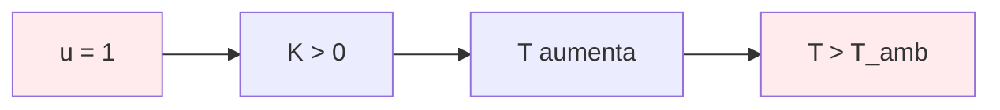
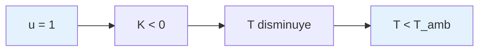

# Teoría del Modelo FOPDT

## 📖 Descripción General

El modelo **FOPDT** (First Order Plus Dead Time) es la representación matemática de la planta térmica en el simulador PID. Este modelo captura la dinámica de un horno o chiller con precisión suficiente para control educativo y validación de algoritmos PID.

## 🔬 Ecuación Diferencial Continua

### Formulación Básica

La ecuación diferencial que describe el comportamiento térmico es:

```
τ·(dT/dt) + T = K·u(t-L) + T_amb
```

Donde:
- *T*(*t*) = Temperatura del sistema [°C]
- *τ* = Constante de tiempo [s]
- *K* = Ganancia efectiva [°C/s por unidad u]
- *u*(*t*) = Entrada de control [0-1]
- *L* = Tiempo muerto [s]
- *T_amb* = Temperatura ambiente [°C]

### Formulación Normalizada

Para facilitar el análisis, se define el estado normalizado:

```
x(t) = T(t) - T_amb
```

La ecuación se convierte en:

```
τ·(dx/dt) + x = K·u(t-L)
```

## 📊 Diagrama de Bloques

```mermaid
graph LR
    A[u(t)] --> B[Delay L]
    B --> C[Gain K]
    C --> D[1st Order τ]
    D --> E[x(t)]
    E --> F[+ T_amb]
    F --> G[T(t)]
    
    style A fill:#e1f5fe
    style G fill:#f3e5f5
    style B fill:#fff3e0
    style D fill:#fff3e0
```

## 🔄 Discretización Exacta

### Motivación

La discretización exacta garantiza:
- **Estabilidad incondicional** para cualquier *T_s* > 0
- **Precisión matemática** que coincide con la solución analítica
- **Sin drift** en simulaciones de larga duración

### Derivación Matemática

#### 1. Solución Analítica Continua

Para un escalón unitario *u*(*t*) = 1, *t* ≥ 0:

```
x(t) = K·(1 - e^(-t/τ))     para t ≥ L
x(t) = 0                    para t < L
```

#### 2. Discretización Exacta

La ecuación de diferencias exacta es:

```
x[k+1] = φ·x[k] + γ·u[k-L_s]
```

Donde:
- *φ* = *e^(-T_s/τ)* (factor de decaimiento)
- *γ* = *K·(1 - φ)* (factor de ganancia)
- *L_s* = *L/T_s* (tiempo muerto en muestras)

### Implementación

```typescript
class FOPDTPlant {
  private phi: number          // e^(-T_s/τ)
  private gamma: number        // K·(1 - φ)
  private dead_time_samples: number
  
  private updateDiscretization(): void {
    this.phi = Math.exp(-this.timestep / this.params.tau)
    this.gamma = this.params.K * (1 - this.phi)
    this.dead_time_samples = Math.round(this.params.L / this.timestep)
  }
  
  step(u_current: number): number {
    // Obtener entrada con tiempo muerto
    const u_delayed = this.getDelayedInput(u_current)
    
    // Ecuación de diferencias exacta
    this.state.x = this.phi * this.state.x + this.gamma * u_delayed
    
    return this.state.x + this.params.T_amb
  }
}
```

## 📈 Respuesta al Escalón

### Análisis Temporal

```mermaid
graph TD
    A[Escalón u(t) = 1] --> B[Delay L]
    B --> C[Respuesta exponencial]
    C --> D[Estado estacionario K]
    
    E[Características] --> F[Tiempo muerto L]
    E --> G[Constante tiempo τ]
    E --> H[Ganancia K]
    
    style A fill:#e8f5e8
    style D fill:#e8f5e8
```

### Parámetros Característicos

1. **Tiempo Muerto (*L*)**: Retardo puro antes de que la respuesta comience
2. **Constante de Tiempo (*τ*)**: Tiempo para alcanzar 63.2% del valor final
3. **Ganancia (*K*)**: Cambio final en temperatura por unidad de entrada

### Fórmulas de Respuesta

#### Tiempo de Subida (10% a 90%)
```
t_r = 2.2·τ
```

#### Tiempo de Establecimiento (5%)
```
t_s = 3·τ
```

#### Tiempo de Establecimiento (2%)
```
t_s = 4·τ
```

## 🔧 Modos de Operación

### Modo Horno (Calentamiento)



- *K* > 0: Entrada positiva aumenta temperatura
- Respuesta: *T*(*t*) → *T_amb* + *K* cuando *t* → ∞

### Modo Chiller (Enfriamiento)



- *K* < 0: Entrada positiva disminuye temperatura
- Respuesta: *T*(*t*) → *T_amb* + *K* cuando *t* → ∞

## 🧮 Validación Analítica

### Caso de Prueba 1: Sin Tiempo Muerto

**Parámetros**: *τ* = 60s, *K* = 0.02°C/s, *L* = 0s, *T_amb* = 25°C

**Solución analítica**:
```
T(t) = 25 + 0.02·60·(1 - e^(-t/60)) = 25 + 1.2·(1 - e^(-t/60))
```

**Validación en código**:
```typescript
// Test case: L=0, escalón unitario
const plant = new FOPDTPlant({
  K: 0.02, tau: 60, L: 0, T_amb: 25, mode: 'horno'
})

// Simular para t = 5τ = 300s
for (let t = 0; t <= 300; t += 0.1) {
  const T_sim = plant.step(1.0)
  const T_analytical = 25 + 1.2 * (1 - Math.exp(-t/60))
  
  // Error debe ser < 1e-10
  expect(Math.abs(T_sim - T_analytical)).toBeLessThan(1e-10)
}
```

### Caso de Prueba 2: Con Tiempo Muerto

**Parámetros**: *τ* = 30s, *K* = 0.01°C/s, *L* = 10s, *T_amb* = 20°C

**Solución analítica**:
```
T(t) = 20                    para t < 10s
T(t) = 20 + 0.01·30·(1 - e^(-(t-10)/30)) = 20 + 0.3·(1 - e^(-(t-10)/30))   para t ≥ 10s
```

## ⚠️ Casos Límite

### τ → 0 (Sistema Muy Rápido)

```
φ → 0, γ → K·T_s
x[k+1] ≈ K·T_s·u[k-L_s]
```

**Comportamiento**: Respuesta instantánea (integrador puro)

### τ → ∞ (Sistema Muy Lento)

```
φ → 1, γ → 0
x[k+1] ≈ x[k]
```

**Comportamiento**: Sistema estático (sin dinámica)

### L → 0 (Sin Tiempo Muerto)

```
L_s = 0
u[k-L_s] = u[k]
```

**Comportamiento**: Sistema de primer orden puro

## 🔍 Análisis de Estabilidad

### Criterio de Estabilidad

La discretización exacta es **incondicionalmente estable**:

```
|φ| = |e^(-T_s/τ)| < 1    para todo T_s > 0, τ > 0
```

### Comparación con Euler

| Método | Estabilidad | Precisión | Complejidad |
|--------|-------------|-----------|-------------|
| **Euler** | Condicional (*T_s* < 2*τ*) | O(*T_s*) | Simple |
| **Exacta** | Incondicional | Exacta | Media |

### Ventajas de Discretización Exacta

1. **Estabilidad garantizada** para cualquier *T_s* > 0
2. **Precisión matemática** vs solución analítica
3. **Sin drift** en simulaciones largas
4. **Validación trivial** contra casos conocidos

## 📊 Parámetros Típicos

### Hornos Industriales

| Aplicación | *τ* [s] | *K* [°C/s] | *L* [s] |
|------------|---------|------------|---------|
| Horno pequeño | 30-60 | 0.02-0.05 | 5-15 |
| Horno medio | 60-180 | 0.01-0.03 | 10-30 |
| Horno grande | 180-600 | 0.005-0.02 | 30-60 |

### Chillers

| Aplicación | *τ* [s] | *K* [°C/s] | *L* [s] |
|------------|---------|------------|---------|
| Chiller compacto | 20-40 | -0.03-(-0.08) | 3-10 |
| Chiller industrial | 40-120 | -0.01-(-0.04) | 8-25 |

## 🔗 Referencias

1. **Franklin, G.F., et al.** "Digital Control of Dynamic Systems" - Capítulo 3
2. **Åström, K.J.** "Computer-Controlled Systems" - Sección 2.3
3. **Seborg, D.E., et al.** "Process Dynamics and Control" - Capítulo 5
4. **ADR-0001**: Discretización exacta vs Euler

---

**Implementación**: `src/lib/simulation/plant-model.ts`  
**Validación**: `tests/fopdt.validation.test.ts`  
**Última actualización**: Enero 2024
