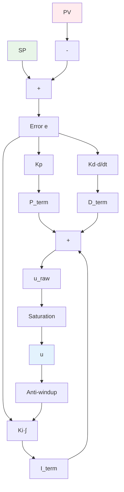
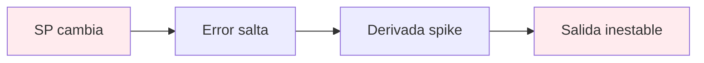
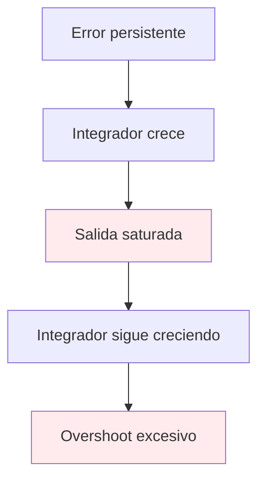
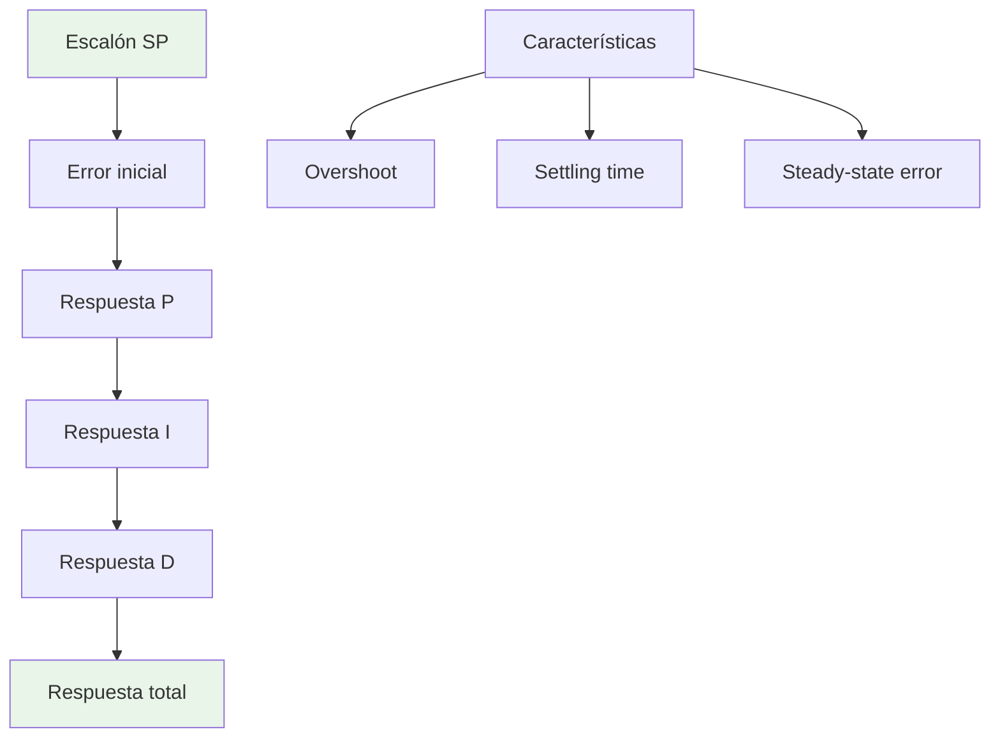
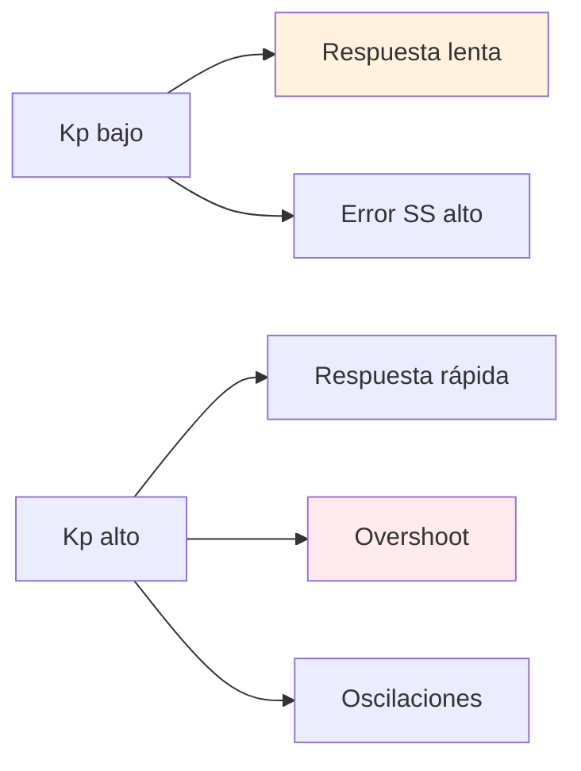
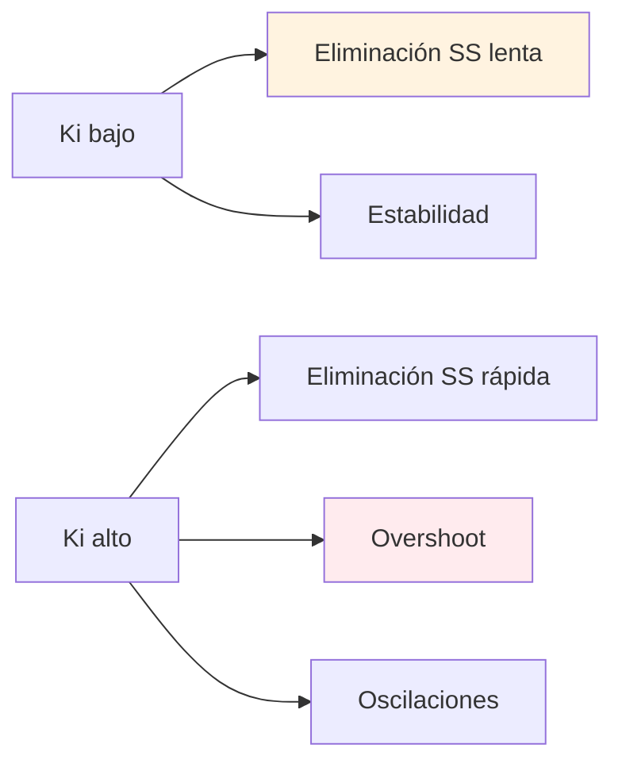
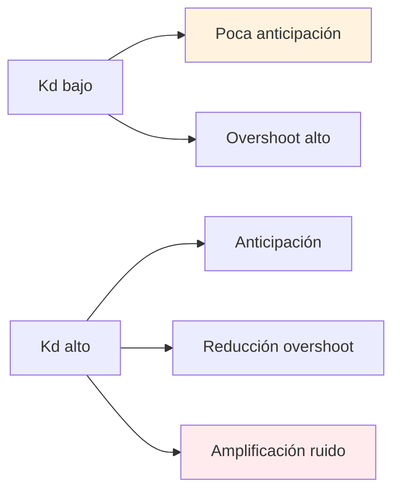
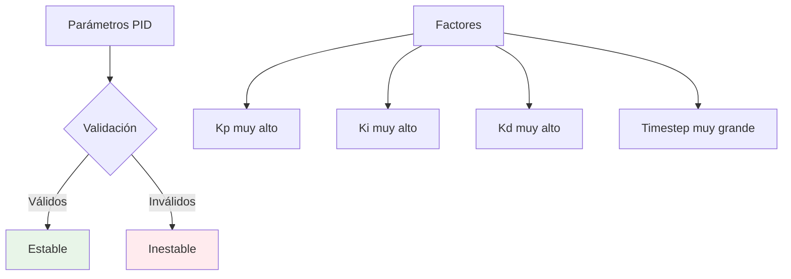

# Teoría del Controlador PID

## 📖 Descripción General

El controlador **PID** (Proportional-Integral-Derivative) implementado en el simulador incluye características avanzadas para uso industrial y educativo: derivada filtrada sobre la medida, anti-windup por back-calculation, y sintonía automática de parámetros.

## 🔬 Formulación Matemática

### Ecuación Básica del PID

La salida del controlador PID está dada por:

```
u(t) = K_p·e(t) + K_i·∫e(τ)dτ + K_d·(de/dt)
```

Donde:
- *u*(*t*) = Salida de control [0-1]
- *e*(*t*) = Error = *SP*(*t*) - *PV*(*t*) [°C]
- *K_p* = Ganancia proporcional [adimensional]
- *K_i* = Ganancia integral [s⁻¹]
- *K_d* = Tiempo derivativo [s]

### Formulación Discreta

En forma discreta con timestep *T_s*:

```
u[k] = K_p·e[k] + K_i·T_s·Σe[i] + K_d·(e[k] - e[k-1])/T_s
```

## 📊 Diagrama de Bloques



## 🔄 Implementación Avanzada

### 1. Derivada Filtrada sobre la Medida

#### Motivación

La derivada calculada sobre el error causa **kick derivativo** en cambios de setpoint:



#### Solución: Derivada sobre PV

```
D_term[k] = -K_d·(PV[k] - PV[k-1])/T_s
```

**Ventajas**:
- ✅ Elimina kick derivativo
- ✅ Reduce ruido de medición
- ✅ Comportamiento realista

#### Filtro de Primer Orden

Para reducir ruido adicional:

```
τ_f = K_d/N
α = τ_f/(τ_f + T_s)
D_filt[k] = α·D_filt[k-1] + (1-α)·(-K_d)·(PV[k] - PV[k-1])/T_s
```

Donde *N* = factor de filtro (default: 10)

### 2. Anti-windup por Back-calculation

#### Problema del Windup



#### Solución: Back-calculation

```
u_raw[k] = P_term[k] + I_term[k] + D_term[k]
u[k] = saturate(u_raw[k], 0, 1)
tracking_error = u[k] - u_raw[k]
I_term[k+1] = I_term[k] + K_i·T_s·e[k] + (T_s/T_t)·tracking_error
```

Donde *T_t* = tiempo de tracking [s]

## 🧮 Algoritmo Completo

### Pseudocódigo

```typescript
function computePID(SP: number, PV: number): PIDOutput {
  const error = SP - PV
  
  // Término proporcional
  const P_term = Kp * error
  
  // Término integral con anti-windup
  const u_raw = P_term + I_term + D_term
  const u_saturated = saturate(u_raw, 0, 1)
  
  if (saturated) {
    const tracking_error = u_saturated - u_raw
    I_term += (Ts / Tt) * tracking_error
  }
  
  I_term += Ki * Ts * error
  
  // Término derivativo filtrado sobre PV
  const pv_derivative = (PV - PV_prev) / Ts
  const alpha = (Kd/N) / ((Kd/N) + Ts)
  D_term = alpha * D_term + (1-alpha) * (-Kd) * pv_derivative
  
  PV_prev = PV
  
  return {
    u: u_saturated,
    u_raw,
    P_term,
    I_term,
    D_term,
    saturated: u_raw !== u_saturated
  }
}
```

### Implementación Real

```typescript
class PIDController {
  compute(SP: number, PV: number): PIDOutput {
    const error = SP - PV
    
    // Término proporcional
    const P_term = this.params.kp * error
    
    // Término integral con integración trapezoidal
    let I_term = 0
    if (this.params.ki > 0) {
      const integral_increment = this.params.ki * 
        (error + this.state.error_prev) * this.timestep / 2
      this.state.integral += integral_increment
      I_term = this.state.integral
    }
    
    // Término derivativo filtrado sobre PV
    let D_term = 0
    if (this.params.kd > 0 && !this.state.first_cycle) {
      const pv_derivative = (PV - this.state.pv_prev) / this.timestep
      const alpha = this.params.N * this.timestep / 
        (this.params.N * this.timestep + 1)
      this.state.derivative_filtered = alpha * this.state.derivative_filtered + 
        (1 - alpha) * this.params.kd * (-pv_derivative)
      D_term = this.state.derivative_filtered
    }
    
    // Salida total y saturación
    const u_raw = P_term + I_term + D_term
    const u_saturated = Math.max(0, Math.min(1, u_raw))
    const saturated = (u_raw !== u_saturated)
    
    // Anti-windup por back-calculation
    if (saturated && this.params.ki > 0) {
      const saturation_error = u_saturated - u_raw
      const tracking_gain = 1 / this.params.Tt
      this.state.integral += tracking_gain * saturation_error * this.timestep
    }
    
    return { u: u_saturated, u_raw, P_term, I_term, D_term, saturated }
  }
}
```

## 📈 Análisis de Respuesta

### Respuesta al Escalón



### Efecto de Cada Término

#### Término Proporcional (*K_p*)



#### Término Integral (*K_i*)



#### Término Derivativo (*K_d*)



## 🔧 Sintonía Automática

### Cálculo de Tiempo de Tracking

```typescript
static calculateAutoTt(kp: number, ki: number): number {
  if (ki <= 0) return 1.0
  
  // Heurística: Tt = Ti/4 donde Ti = Kp/Ki
  const Ti = kp / ki
  return Math.max(0.1, Ti / 4)
}
```

### Validación de Parámetros

```typescript
static validateParameters(params: PIDParameters, timestep: number): ValidationResult {
  const errors: string[] = []
  const warnings: string[] = []
  
  // Validaciones críticas
  if (params.kp < 0) errors.push('Kp debe ser ≥ 0')
  if (params.ki < 0) errors.push('Ki debe ser ≥ 0')
  if (params.kd < 0) errors.push('Kd debe ser ≥ 0')
  
  // Validaciones de estabilidad
  if (params.N * timestep > 1) {
    warnings.push(`Factor N muy alto para Ts=${timestep}`)
  }
  
  return { valid: errors.length === 0, errors, warnings }
}
```

## 🧮 Casos de Prueba

### Test 1: Sin Kick Derivativo

```typescript
test('no derivative kick on setpoint change', () => {
  const pid = new PIDController({ kp: 1, ki: 0, kd: 10, N: 10 })
  
  // Estado estacionario
  pid.compute(50, 50) // SP=50, PV=50
  
  // Cambio brusco de SP
  const output = pid.compute(80, 50) // SP=80, PV=50
  
  // Derivada debe ser 0 (no hay cambio en PV)
  expect(output.D_term).toBeCloseTo(0, 3)
})
```

### Test 2: Anti-windup Efectivo

```typescript
test('back-calculation prevents excessive overshoot', () => {
  const pid = new PIDController({ kp: 1, ki: 0.5, kd: 0, N: 10 })
  
  let max_PV = 0
  let overshoot = 0
  
  // Simular respuesta saturada
  for (let i = 0; i < 1000; i++) {
    const PV = simulatePlantResponse(/* ... */)
    const output = pid.compute(80, PV)
    
    max_PV = Math.max(max_PV, PV)
  }
  
  overshoot = (max_PV - 80) / 80 * 100
  
  // Debe ser menor que sin anti-windup
  expect(overshoot).toBeLessThan(30)
})
```

## 📊 Presets Típicos

### Configuraciones Predefinidas

| Preset | *K_p* | *K_i* [s⁻¹] | *K_d* [s] | *N* | Aplicación |
|--------|-------|-------------|-----------|-----|------------|
| Conservador | 0.5 | 0.05 | 2 | 10 | Procesos lentos |
| Balanceado | 1.0 | 0.1 | 5 | 10 | Uso general |
| Agresivo | 2.0 | 0.2 | 10 | 10 | Procesos rápidos |

### Reglas de Sintonía

#### Método de Ziegler-Nichols (Aproximado)

1. **Determinar *K_u***: Aumentar *K_p* hasta oscilaciones sostenidas
2. **Determinar *T_u***: Período de oscilaciones
3. **Calcular parámetros**:
   - *K_p* = 0.6·*K_u*
   - *K_i* = 1.2·*K_p*/*T_u*
   - *K_d* = 0.075·*K_p*·*T_u*

#### Método de Cohen-Coon

Para sistemas FOPDT con *L/τ* < 1:

```
Kp = (1/K)·(τ/L)·(1 + L/(3τ))
Ki = (1/K)·(τ/L)·(1 + L/(3τ))·(1 + L/(6τ))
Kd = (1/K)·(τ/L)·(1 + L/(3τ))·L/6
```

## ⚠️ Casos Límite

### *K_p* → 0 (Control Puro)

```
u(t) ≈ K_i·∫e(τ)dτ + K_d·(de/dt)
```

**Comportamiento**: Respuesta muy lenta, error de estado estacionario

### *K_i* → 0 (Control PD)

```
u(t) = K_p·e(t) + K_d·(de/dt)
```

**Comportamiento**: Respuesta rápida, error de estado estacionario

### *K_d* → 0 (Control PI)

```
u(t) = K_p·e(t) + K_i·∫e(τ)dτ
```

**Comportamiento**: Sin anticipación, posible overshoot

## 🔍 Análisis de Estabilidad

### Criterios de Estabilidad

1. **Estabilidad de Lyapunov**: Para sistemas lineales
2. **Criterio de Routh-Hurwitz**: Para polinomios característicos
3. **Análisis de Nyquist**: Para sistemas con retardo

### Región de Estabilidad



## 🔗 Referencias

1. **Åström, K.J. & Hägglund, T.** "Advanced PID Control" - Capítulos 3 y 6
2. **Visioli, A.** "Practical PID Control" - Derivada filtrada y anti-windup
3. **ISA Standard 51.1-1979** "Process Instrumentation Terminology"
4. **ADR-0002**: Derivada filtrada y anti-windup

---

**Implementación**: `src/lib/simulation/pid-controller.ts`  
**Validación**: `tests/pid.antiwindup.test.ts`, `tests/pid.derivative.noise.test.ts`  
**Última actualización**: Enero 2024
