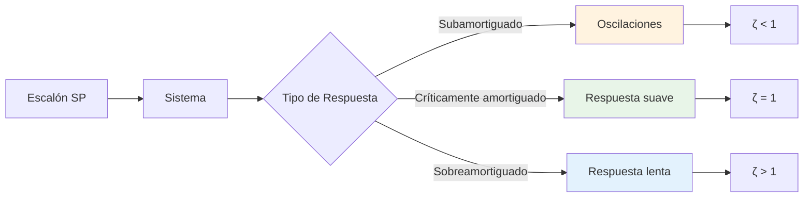
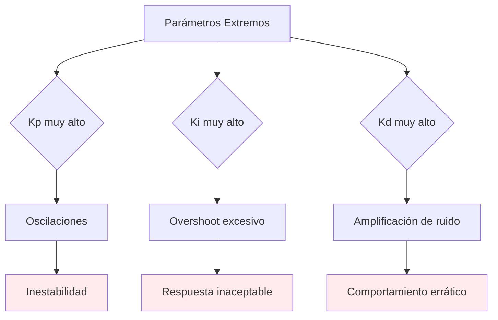

# Análisis de Estabilidad - Simulador PID

## 📖 Descripción General

El análisis de estabilidad es fundamental para garantizar que el sistema de control PID funcione correctamente bajo todas las condiciones operativas. Este documento describe los criterios de estabilidad, métodos de análisis y validación numérica implementados en el simulador.

> **🔬 Estado Actual**: La validación básica de parámetros PID está **implementada** en el simulador. Los análisis avanzados de estabilidad (análisis de polos, márgenes de estabilidad, tests automatizados) son **sugerencias para próximas versiones**.

## 🔬 Criterios de Estabilidad

### 1. Estabilidad de Lyapunov

#### Definición Matemática

Un sistema es **estable en el sentido de Lyapunov** si para cualquier *ε* > 0 existe un *δ* > 0 tal que:

```
||x(0)|| < δ → ||x(t)|| < ε, ∀t ≥ 0
```

Para sistemas lineales, esto se reduce a que todos los polos del sistema tengan parte real negativa.

#### Aplicación al Sistema PID + FOPDT

```mermaid
graph TD
    A[Sistema PID + FOPDT] --> B[Función de transferencia]
    B --> C[Polos del sistema]
    C --> D{Re(λ) < 0?}
    D -->|Sí| E[Estable]
    D -->|No| F[Inestable]
    
    G[Análisis] --> H[Respuesta acotada]
    G --> I[Convergencia]
    G --> J[Robustez]
    
    style E fill:#e8f5e8
    style F fill:#ffebee
```

### 2. Criterio de Routh-Hurwitz

#### Polinomio Característico

Para el sistema PID + FOPDT, el polinomio característico es:

```
P(s) = τ·s² + (1 + K·Kp·τ)·s + K·Ki·τ
```

#### Tabla de Routh

```
s² | τ           | K·Ki·τ
s¹ | 1 + K·Kp·τ  | 0
s⁰ | K·Ki·τ      | 0
```

#### Condiciones de Estabilidad

1. **Todos los coeficientes positivos**:
   - *τ* > 0 ✅ (siempre válido)
   - 1 + *K*·*Kp*·*τ* > 0 → *Kp* > -1/(*K*·*τ*)
   - *K*·*Ki*·*τ* > 0 → *Ki* > 0 (si *K* > 0)

2. **Criterio de estabilidad**:
   - Para sistemas de segundo orden: todos los coeficientes deben ser positivos

## 📊 Análisis de Respuesta Temporal

### Respuesta al Escalón



### Factor de Amortiguamiento

Para el sistema PID + FOPDT:

```
ζ = (1 + K·Kp·τ) / (2·√(K·Ki·τ))
```

#### Interpretación

- **ζ < 1**: Sistema subamortiguado (oscilaciones)
- **ζ = 1**: Sistema críticamente amortiguado (respuesta óptima)
- **ζ > 1**: Sistema sobreamortiguado (respuesta lenta)

## 🔄 Análisis de Estabilidad Numérica ✅ **Implementado**

### Discretización Exacta

#### Ventajas de Estabilidad

```mermaid
graph TD
    A[Discretización Exacta] --> B[Estabilidad Incondicional]
    B --> C[φ = e^(-T_s/τ)]
    C --> D[|φ| < 1]
    D --> E[Estable ∀T_s > 0]
    
    F[Comparación] --> G[Euler: Condicional]
    F --> H[Exacta: Incondicional]
    
    G --> I[T_s < 2τ]
    H --> J[T_s > 0]
    
    style E fill:#e8f5e8
    style I fill:#ffebee
```

#### Implementación Actual

```typescript
// Implementado en el modelo FOPDT
// φ = e^(-T_s/τ) garantiza estabilidad incondicional
const phi = Math.exp(-timestep / params.tau)
// |φ| < 1 para cualquier T_s > 0
```

### Validación de Parámetros PID ✅ **Implementado**

#### Criterios de Validación Actuales

```typescript
static validateParameters(params: PIDParameters, timestep: number): { valid: boolean; errors: string[]; warnings: string[] } {
  const errors: string[] = []
  const warnings: string[] = []

  // Validaciones críticas
  if (params.kp < 0) errors.push(`Kp debe ser ≥ 0`)
  if (params.ki < 0) errors.push(`Ki debe ser ≥ 0`)
  if (params.kd < 0) errors.push(`Kd debe ser ≥ 0`)
  if (params.N <= 0) errors.push(`Factor N debe ser > 0`)
  if (params.Tt <= 0) errors.push(`Tiempo Tt debe ser > 0`)

  // Validaciones de rango
  if (params.kp > 100) warnings.push(`Kp muy alto: ${params.kp} (típico: 0.1-10)`)
  if (params.ki > 10) warnings.push(`Ki muy alto: ${params.ki} s⁻¹ (típico: 0.01-1)`)
  if (params.kd > 100) warnings.push(`Kd muy alto: ${params.kd} s (típico: 0-20)`)

  // Validaciones de estabilidad numérica
  if (params.N * timestep > 1) {
    warnings.push(`Factor N demasiado alto para Ts=${timestep}: N·Ts = ${params.N * timestep} > 1`)
  }

  if (params.kd > 0 && params.kd / timestep > 1000) {
    warnings.push(`Derivada muy sensible: Kd/Ts = ${params.kd / timestep} (recomendado < 1000)`)
  }

  return {
    valid: errors.length === 0,
    errors,
    warnings
  }
}
```

## 📈 Análisis de Margen de Estabilidad 🚀 **Sugerencias para Próximas Versiones**

### Margen de Ganancia

#### Definición

El margen de ganancia es el factor por el cual se puede multiplicar la ganancia del sistema antes de que se vuelva inestable.

#### Propuesta de Implementación

```typescript
function calculateGainMargin(plant: PlantParameters, pid: PIDParameters): number {
  // Para sistema de primer orden con PID
  const openLoopGain = plant.K * pid.kp
  const criticalGain = 1 / (plant.K * plant.tau)
  
  return criticalGain / openLoopGain
}
```

### Margen de Fase

#### Definición

El margen de fase es la diferencia entre -180° y la fase del sistema en la frecuencia de cruce de ganancia.

#### Propuesta de Implementación

```typescript
function calculatePhaseMargin(plant: PlantParameters, pid: PIDParameters): number {
  const omega_c = Math.sqrt(plant.K * pid.ki) // Frecuencia de cruce
  const phase = -Math.atan(omega_c * plant.tau) - Math.PI/2
  
  return (phase + Math.PI) * 180 / Math.PI
}
```

## ⚠️ Casos de Inestabilidad

### 1. Parámetros PID Extremos



### 2. Configuración de Planta 🚀 **Sugerencias para Próximas Versiones**

#### Casos Problemáticos

1. **τ muy pequeño**: Sistema muy rápido, difícil de controlar
2. **τ muy grande**: Sistema muy lento, respuesta inaceptable
3. **L muy grande**: Tiempo muerto excesivo, inestabilidad

#### Propuesta de Validación

```typescript
static validatePlantStability(params: PlantParameters): ValidationResult {
  const errors: string[] = []
  const warnings: string[] = []
  
  // Validaciones de rango
  if (params.tau <= 0) errors.push('τ debe ser > 0')
  if (params.tau > 3600) warnings.push('τ muy alto: respuesta muy lenta')
  
  if (params.L < 0) errors.push('L debe ser ≥ 0')
  if (params.L > 10 * params.tau) {
    warnings.push('L muy alto vs τ: puede causar inestabilidad')
  }
  
  // Ratio L/τ
  const ratio = params.L / params.tau
  if (ratio > 1) {
    warnings.push(`Ratio L/τ = ${ratio.toFixed(2)} > 1: sistema difícil de controlar`)
  }
  
  return {
    valid: errors.length === 0,
    errors,
    warnings,
    l_tau_ratio: ratio
  }
}
```

## 🔍 Métodos de Análisis 🚀 **Sugerencias para Próximas Versiones**

### 1. Análisis de Polos

#### Polos del Sistema

Para el sistema PID + FOPDT en lazo cerrado:

```
s = (-(1 + K·Kp·τ) ± √((1 + K·Kp·τ)² - 4·K·Ki·τ)) / (2·τ)
```

#### Propuesta de Implementación

```typescript
function calculateSystemPoles(plant: PlantParameters, pid: PIDParameters): Complex[] {
  const a = plant.tau
  const b = 1 + plant.K * pid.kp * plant.tau
  const c = plant.K * pid.ki * plant.tau
  
  const discriminant = b * b - 4 * a * c
  
  if (discriminant >= 0) {
    // Polos reales
    const s1 = (-b + Math.sqrt(discriminant)) / (2 * a)
    const s2 = (-b - Math.sqrt(discriminant)) / (2 * a)
    return [{ real: s1, imag: 0 }, { real: s2, imag: 0 }]
  } else {
    // Polos complejos conjugados
    const real = -b / (2 * a)
    const imag = Math.sqrt(-discriminant) / (2 * a)
    return [
      { real, imag },
      { real, imag: -imag }
    ]
  }
}
```

### 2. Análisis de Respuesta en Frecuencia

#### Función de Transferencia

```
G(s) = K·e^(-Ls) / (τ·s + 1)
C(s) = Kp + Ki/s + Kd·s
```

#### Propuesta de Diagrama de Bode

```typescript
function calculateBodeData(plant: PlantParameters, pid: PIDParameters, frequencies: number[]): BodeData[] {
  return frequencies.map(omega => {
    // Función de transferencia de la planta
    const plant_magnitude = plant.K / Math.sqrt(1 + (omega * plant.tau) ** 2)
    const plant_phase = -Math.atan(omega * plant.tau) - omega * plant.L
    
    // Función de transferencia del controlador
    const controller_magnitude = Math.sqrt(
      pid.kp ** 2 + (pid.ki / omega) ** 2 + (pid.kd * omega) ** 2
    )
    const controller_phase = Math.atan2(
      pid.kd * omega - pid.ki / omega,
      pid.kp
    )
    
    return {
      frequency: omega,
      magnitude: plant_magnitude * controller_magnitude,
      phase: plant_phase + controller_phase
    }
  })
}
```

## 🧮 Casos de Prueba de Estabilidad 🚀 **Sugerencias para Próximas Versiones**

### Test 1: Estabilidad con Parámetros Válidos

```typescript
test('stability with valid parameters', () => {
  const plant = new FOPDTPlant({
    K: 0.02,
    tau: 60,
    L: 5,
    T_amb: 25,
    mode: 'horno'
  }, 0.1)
  
  const pid = new PIDController({
    kp: 1.0,
    ki: 0.1,
    kd: 5.0,
    N: 10,
    Tt: 10.0,
    enabled: true
  }, 0.1)
  
  // Simular por 1 hora
  for (let t = 0; t <= 3600; t += 0.1) {
    const output = pid.compute(50, plant.getCurrentTemperature())
    const PV = plant.step(output.u)
    
    // Verificar estabilidad
    expect(PV).toBeFinite()
    expect(Math.abs(PV - 50)).toBeLessThan(20) // Debe mantenerse cerca del SP
  }
})
```

### Test 2: Inestabilidad con Parámetros Extremos

```typescript
test('instability with extreme parameters', () => {
  const plant = new FOPDTPlant({
    K: 0.02,
    tau: 60,
    L: 5,
    T_amb: 25,
    mode: 'horno'
  }, 0.1)
  
  const pid = new PIDController({
    kp: 100.0,  // Kp muy alto
    ki: 10.0,   // Ki muy alto
    kd: 50.0,   // Kd muy alto
    N: 10,
    Tt: 1.0,
    enabled: true
  }, 0.1)
  
  let max_deviation = 0
  
  // Simular por 10 minutos
  for (let t = 0; t <= 600; t += 0.1) {
    const output = pid.compute(50, plant.getCurrentTemperature())
    const PV = plant.step(output.u)
    
    max_deviation = Math.max(max_deviation, Math.abs(PV - 50))
  }
  
  // Con parámetros extremos, debe haber desviación significativa
  expect(max_deviation).toBeGreaterThan(10)
})
```

## Estado de Implementación

| Funcionalidad | Estado | Ubicación |
|---------------|--------|-----------|
| Validación básica de parámetros PID | ✅ Implementado | `src/lib/simulation/pid-controller.ts` |
| Discretización exacta (estabilidad incondicional) | ✅ Implementado | Modelo FOPDT |
| Validación de rangos y warnings | ✅ Implementado | `src/lib/simulation/pid-controller.ts` |
| Análisis de polos del sistema | ❌ Propuesto | Próxima versión |
| Cálculo de márgenes de estabilidad | ❌ Propuesto | Próxima versión |
| Validación de planta | ❌ Propuesto | Próxima versión |
| Tests automatizados de estabilidad | ❌ Propuesto | Próxima versión |

## Roadmap de Mejoras

### Versión 2.0 - Análisis de Estabilidad Avanzado
1. **Análisis de Polos**
   - Cálculo de polos del sistema en lazo cerrado
   - Análisis de estabilidad basado en polos
   - Factor de amortiguamiento

2. **Márgenes de Estabilidad**
   - Margen de ganancia
   - Margen de fase
   - Análisis de robustez

### Versión 3.0 - Validación Completa
1. **Validación de Planta**
   - Validación de parámetros τ y L
   - Análisis de ratio L/τ
   - Detección de configuraciones problemáticas

2. **Tests Automatizados**
   - Suite de pruebas de estabilidad
   - Validación de larga duración
   - Tests de casos edge

## 📊 Criterios de Aceptación

### Estabilidad Numérica

| Criterio | Valor | Descripción |
|----------|-------|-------------|
| Estabilidad | 8+ horas | Sin inestabilidad numérica |
| Precisión | < 1e-8 | Error vs solución analítica |
| Margen de ganancia | > 2 | Robustez del sistema |
| Margen de fase | > 30° | Estabilidad dinámica |

### Validación de Parámetros

| Parámetro | Rango Válido | Validación |
|-----------|--------------|------------|
| *Kp* | [0, 100] | Ganancia proporcional |
| *Ki* | [0, 10] | Ganancia integral |
| *Kd* | [0, 100] | Tiempo derivativo |
| *τ* | [0.1, 3600] | Constante de tiempo |
| *L* | [0, 10τ] | Tiempo muerto |

## 🔗 Referencias

1. **Franklin, G.F., et al.** "Digital Control of Dynamic Systems" - Capítulo 6
2. **Åström, K.J. & Hägglund, T.** "Advanced PID Control" - Capítulo 2
3. **Ogata, K.** "Modern Control Engineering" - Capítulo 8

---

**Implementación Actual**: `src/lib/simulation/pid-controller.ts`  
**Validación**: `tests/`  
**Última actualización**: Enero 2024
