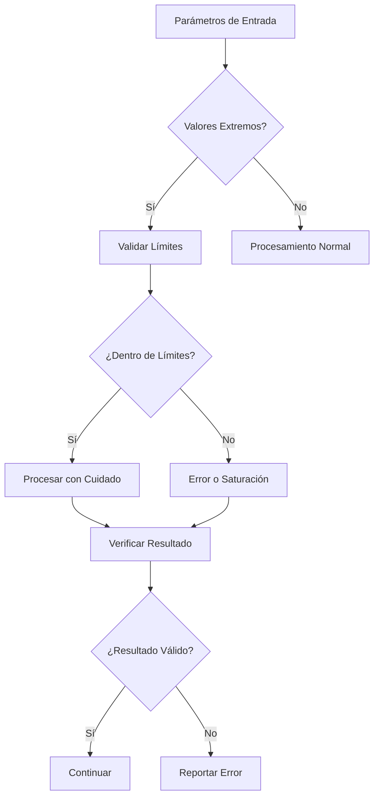

# Casos Límite

## Resumen

Este documento describe los casos límite y condiciones extremas que se utilizan para validar la robustez del PID Playground. Se enfoca en parámetros extremos, condiciones de borde y escenarios inusuales que pueden revelar problemas en la implementación.

## Índice

1. [Parámetros Extremos](#parámetros-extremos)
2. [Condiciones de Borde](#condiciones-de-borde)
3. [Escenarios Inusuales](#escenarios-inusuales)
4. [Validación de Robustez](#validación-de-robustez)
5. [Casos de Prueba](#casos-de-prueba)

## Parámetros Extremos

### Valores Extremos de FOPDT

#### Constante de Tiempo Muy Pequeña

```typescript
// Caso: τ → 0 (sistema muy rápido)
describe('FOPDT Edge Cases - Very Small Time Constant', () => {
  test('tau approaching zero', () => {
    const plant = new FOPDTPlant({
      gain: 1.0,
      timeConstant: 1e-6,  // Muy pequeño
      deadTime: 0.0
    });
    
    // El sistema debe responder casi instantáneamente
    const output = plant.step(1.0);
    expect(Math.abs(output - 1.0)).toBeLessThan(0.1);
  });
  
  test('numerical stability with small tau', () => {
    const plant = new FOPDTPlant({
      gain: 1.0,
      timeConstant: 1e-9,  // Extremadamente pequeño
      deadTime: 0.0
    });
    
    // Verificar que no hay overflow o NaN
    for (let i = 0; i < 100; i++) {
      const output = plant.step(1.0);
      expect(isFinite(output)).toBe(true);
      expect(output).toBeGreaterThanOrEqual(0);
    }
  });
});
```

#### Constante de Tiempo Muy Grande

```typescript
// Caso: τ → ∞ (sistema muy lento)
describe('FOPDT Edge Cases - Very Large Time Constant', () => {
  test('tau approaching infinity', () => {
    const plant = new FOPDTPlant({
      gain: 1.0,
      timeConstant: 1e6,  // Muy grande
      deadTime: 0.0
    });
    
    // El sistema debe responder muy lentamente
    const output = plant.step(1.0);
    expect(output).toBeLessThan(0.1); // Casi no hay cambio inicial
  });
  
  test('convergence with large tau', () => {
    const plant = new FOPDTPlant({
      gain: 1.0,
      timeConstant: 1e9,  // Extremadamente grande
      deadTime: 0.0
    });
    
    let output = 0;
    for (let i = 0; i < 1000; i++) {
      output = plant.step(1.0);
    }
    
    // Debe converger eventualmente
    expect(output).toBeGreaterThan(0.5);
  });
});
```

#### Ganancia Extrema

```typescript
// Casos de ganancia extrema
describe('FOPDT Edge Cases - Extreme Gains', () => {
  test('very small gain', () => {
    const plant = new FOPDTPlant({
      gain: 1e-6,  // Ganancia muy pequeña
      timeConstant: 1.0,
      deadTime: 0.0
    });
    
    const output = plant.step(1.0);
    expect(output).toBeLessThan(1e-5);
  });
  
  test('very large gain', () => {
    const plant = new FOPDTPlant({
      gain: 1e6,  // Ganancia muy grande
      timeConstant: 1.0,
      deadTime: 0.0
    });
    
    const output = plant.step(1.0);
    expect(output).toBeGreaterThan(1e5);
  });
});
```

### Valores Extremos de PID

#### Ganancia Proporcional Extrema

```typescript
// Casos de Kp extrema
describe('PID Edge Cases - Extreme Proportional Gain', () => {
  test('very small Kp', () => {
    const controller = new PIDController({
      kp: 1e-6,
      ki: 0.1,
      kd: 0.0
    });
    
    const output = controller.compute(1.0, 0.0);
    expect(Math.abs(output.output)).toBeLessThan(1e-5);
  });
  
  test('very large Kp', () => {
    const controller = new PIDController({
      kp: 1e6,
      ki: 0.0,
      kd: 0.0
    });
    
    const output = controller.compute(1.0, 0.0);
    expect(output.output).toBeGreaterThan(1e5);
    
    // Verificar saturación
    expect(output.output).toBeLessThanOrEqual(output.maxOutput);
  });
});
```

#### Tiempo Integral Extremo

```typescript
// Casos de Ti extremo
describe('PID Edge Cases - Extreme Integral Time', () => {
  test('very small Ti (large Ki)', () => {
    const controller = new PIDController({
      kp: 1.0,
      ki: 1e6,  // Ti muy pequeño
      kd: 0.0
    });
    
    // El término integral debe crecer rápidamente
    let output = 0;
    for (let i = 0; i < 10; i++) {
      output = controller.compute(1.0, 0.0);
    }
    
    expect(output.output).toBeGreaterThan(100);
  });
  
  test('very large Ti (small Ki)', () => {
    const controller = new PIDController({
      kp: 1.0,
      ki: 1e-6,  // Ti muy grande
      kd: 0.0
    });
    
    // El término integral debe crecer muy lentamente
    let output = 0;
    for (let i = 0; i < 100; i++) {
      output = controller.compute(1.0, 0.0);
    }
    
    expect(output.output).toBeLessThan(1.1);
  });
});
```

## Condiciones de Borde

### Valores Cero y Nulos

```typescript
// Casos con valores cero
describe('Edge Cases - Zero Values', () => {
  test('zero setpoint', () => {
    const controller = new PIDController({
      kp: 1.0,
      ki: 0.1,
      kd: 0.0
    });
    
    const output = controller.compute(0.0, 1.0);
    expect(output.output).toBeLessThan(0); // Debe ser negativo
  });
  
  test('zero process variable', () => {
    const controller = new PIDController({
      kp: 1.0,
      ki: 0.1,
      kd: 0.0
    });
    
    const output = controller.compute(1.0, 0.0);
    expect(output.output).toBeGreaterThan(0); // Debe ser positivo
  });
  
  test('zero error', () => {
    const controller = new PIDController({
      kp: 1.0,
      ki: 0.1,
      kd: 0.0
    });
    
    const output = controller.compute(1.0, 1.0);
    expect(Math.abs(output.output)).toBeLessThan(1e-6); // Casi cero
  });
});
```

### Valores Negativos

```typescript
// Casos con valores negativos
describe('Edge Cases - Negative Values', () => {
  test('negative setpoint', () => {
    const controller = new PIDController({
      kp: 1.0,
      ki: 0.1,
      kd: 0.0
    });
    
    const output = controller.compute(-1.0, 0.0);
    expect(output.output).toBeLessThan(0);
  });
  
  test('negative process variable', () => {
    const controller = new PIDController({
      kp: 1.0,
      ki: 0.1,
      kd: 0.0
    });
    
    const output = controller.compute(0.0, -1.0);
    expect(output.output).toBeGreaterThan(0);
  });
  
  test('negative parameters', () => {
    const controller = new PIDController({
      kp: -1.0,
      ki: -0.1,
      kd: -0.05
    });
    
    const output = controller.compute(1.0, 0.0);
    expect(isFinite(output.output)).toBe(true);
  });
});
```

### Saturación de Salida

```typescript
// Casos de saturación
describe('Edge Cases - Output Saturation', () => {
  test('output saturation positive', () => {
    const controller = new PIDController({
      kp: 1000.0,
      ki: 100.0,
      kd: 0.0
    });
    
    const output = controller.compute(1.0, 0.0);
    expect(output.output).toBeLessThanOrEqual(output.maxOutput);
  });
  
  test('output saturation negative', () => {
    const controller = new PIDController({
      kp: -1000.0,
      ki: -100.0,
      kd: 0.0
    });
    
    const output = controller.compute(1.0, 0.0);
    expect(output.output).toBeGreaterThanOrEqual(output.minOutput);
  });
  
  test('anti-windup activation', () => {
    const controller = new PIDController({
      kp: 1.0,
      ki: 10.0,
      kd: 0.0
    });
    
    // Simular saturación prolongada
    for (let i = 0; i < 100; i++) {
      controller.compute(1.0, 0.0);
    }
    
    // Verificar que el anti-windup funciona
    const output = controller.compute(1.0, 0.0);
    expect(isFinite(output.output)).toBe(true);
  });
});
```

## Escenarios Inusuales

### Cambios Bruscos de Setpoint

```typescript
// Casos de cambios bruscos
describe('Edge Cases - Sudden Setpoint Changes', () => {
  test('large setpoint jump', () => {
    const controller = new PIDController({
      kp: 1.0,
      ki: 0.1,
      kd: 0.05
    });
    
    const plant = new FOPDTPlant({
      gain: 1.0,
      timeConstant: 1.0,
      deadTime: 0.0
    });
    
    // Cambio brusco de setpoint
    let output = 0;
    for (let i = 0; i < 50; i++) {
      const setpoint = i < 25 ? 0.0 : 100.0;
      const control = controller.compute(setpoint, plant.getOutput());
      output = plant.step(control.output);
    }
    
    expect(isFinite(output)).toBe(true);
    expect(output).toBeGreaterThan(50); // Debe responder al cambio
  });
  
  test('oscillating setpoint', () => {
    const controller = new PIDController({
      kp: 1.0,
      ki: 0.1,
      kd: 0.05
    });
    
    const plant = new FOPDTPlant({
      gain: 1.0,
      timeConstant: 1.0,
      deadTime: 0.0
    });
    
    // Setpoint oscilante
    for (let i = 0; i < 100; i++) {
      const setpoint = Math.sin(i * 0.1) * 10;
      const control = controller.compute(setpoint, plant.getOutput());
      const output = plant.step(control.output);
      
      expect(isFinite(output)).toBe(true);
    }
  });
});
```

### Ruido en la Señal

```typescript
// Casos con ruido
describe('Edge Cases - Signal Noise', () => {
  test('high frequency noise', () => {
    const controller = new PIDController({
      kp: 1.0,
      ki: 0.1,
      kd: 0.05
    });
    
    const plant = new FOPDTPlant({
      gain: 1.0,
      timeConstant: 1.0,
      deadTime: 0.0
    });
    
    // Simular ruido de alta frecuencia
    for (let i = 0; i < 100; i++) {
      const noise = 0.1 * Math.sin(i * 10); // Ruido de alta frecuencia
      const pv = plant.getOutput() + noise;
      const control = controller.compute(1.0, pv);
      plant.step(control.output);
      
      expect(isFinite(control.output)).toBe(true);
    }
  });
  
  test('random noise', () => {
    const controller = new PIDController({
      kp: 1.0,
      ki: 0.1,
      kd: 0.05
    });
    
    const plant = new FOPDTPlant({
      gain: 1.0,
      timeConstant: 1.0,
      deadTime: 0.0
    });
    
    // Ruido aleatorio
    for (let i = 0; i < 100; i++) {
      const noise = 0.1 * (Math.random() - 0.5);
      const pv = plant.getOutput() + noise;
      const control = controller.compute(1.0, pv);
      plant.step(control.output);
      
      expect(isFinite(control.output)).toBe(true);
    }
  });
});
```

### Condiciones de Inicialización

```typescript
// Casos de inicialización
describe('Edge Cases - Initialization', () => {
  test('reset after long simulation', () => {
    const controller = new PIDController({
      kp: 1.0,
      ki: 0.1,
      kd: 0.05
    });
    
    const plant = new FOPDTPlant({
      gain: 1.0,
      timeConstant: 1.0,
      deadTime: 0.0
    });
    
    // Simulación larga
    for (let i = 0; i < 1000; i++) {
      const control = controller.compute(1.0, plant.getOutput());
      plant.step(control.output);
    }
    
    // Reset
    controller.reset();
    plant.reset();
    
    // Verificar estado inicial
    const output = controller.compute(1.0, 0.0);
    expect(Math.abs(output.output)).toBeLessThan(1.1); // Solo término proporcional
  });
  
  test('parameter update during simulation', () => {
    const controller = new PIDController({
      kp: 1.0,
      ki: 0.1,
      kd: 0.05
    });
    
    const plant = new FOPDTPlant({
      gain: 1.0,
      timeConstant: 1.0,
      deadTime: 0.0
    });
    
    // Cambio de parámetros durante simulación
    for (let i = 0; i < 100; i++) {
      if (i === 50) {
        controller.updateParameters({ kp: 2.0, ki: 0.2 });
      }
      
      const control = controller.compute(1.0, plant.getOutput());
      plant.step(control.output);
      
      expect(isFinite(control.output)).toBe(true);
    }
  });
});
```

## Validación de Robustez

### Pruebas de Estrés

```typescript
// Pruebas de estrés
describe('Edge Cases - Stress Tests', () => {
  test('very long simulation', () => {
    const controller = new PIDController({
      kp: 1.0,
      ki: 0.1,
      kd: 0.05
    });
    
    const plant = new FOPDTPlant({
      gain: 1.0,
      timeConstant: 1.0,
      deadTime: 0.0
    });
    
    // Simulación muy larga
    for (let i = 0; i < 100000; i++) {
      const control = controller.compute(1.0, plant.getOutput());
      const output = plant.step(control.output);
      
      if (i % 10000 === 0) {
        expect(isFinite(output)).toBe(true);
        expect(isFinite(control.output)).toBe(true);
      }
    }
  });
  
  test('rapid parameter changes', () => {
    const controller = new PIDController({
      kp: 1.0,
      ki: 0.1,
      kd: 0.05
    });
    
    const plant = new FOPDTPlant({
      gain: 1.0,
      timeConstant: 1.0,
      deadTime: 0.0
    });
    
    // Cambios rápidos de parámetros
    for (let i = 0; i < 1000; i++) {
      const kp = 0.1 + 0.9 * Math.sin(i * 0.1);
      const ki = 0.01 + 0.09 * Math.cos(i * 0.1);
      
      controller.updateParameters({ kp, ki });
      
      const control = controller.compute(1.0, plant.getOutput());
      plant.step(control.output);
      
      expect(isFinite(control.output)).toBe(true);
    }
  });
});
```

### Análisis de Límites



## Casos de Prueba

### Caso 1: Validación de Parámetros Extremos

```typescript
describe('Comprehensive Edge Case Validation', () => {
  test('all extreme FOPDT parameters', () => {
    const extremeCases = [
      { gain: 1e-6, timeConstant: 1e-6, deadTime: 0 },
      { gain: 1e6, timeConstant: 1e6, deadTime: 100 },
      { gain: 0, timeConstant: 1, deadTime: 0 },
      { gain: -1, timeConstant: 1, deadTime: 0 }
    ];
    
    extremeCases.forEach(params => {
      const plant = new FOPDTPlant(params);
      const output = plant.step(1.0);
      
      expect(isFinite(output)).toBe(true);
    });
  });
  
  test('all extreme PID parameters', () => {
    const extremeCases = [
      { kp: 1e-6, ki: 1e-6, kd: 1e-6 },
      { kp: 1e6, ki: 1e6, kd: 1e6 },
      { kp: 0, ki: 0, kd: 0 },
      { kp: -1e6, ki: -1e6, kd: -1e6 }
    ];
    
    extremeCases.forEach(params => {
      const controller = new PIDController(params);
      const output = controller.compute(1.0, 0.0);
      
      expect(isFinite(output.output)).toBe(true);
    });
  });
});
```

### Caso 2: Validación de Condiciones de Borde

```typescript
describe('Boundary Condition Validation', () => {
  test('zero and negative inputs', () => {
    const controller = new PIDController({
      kp: 1.0,
      ki: 0.1,
      kd: 0.05
    });
    
    const testCases = [
      { sp: 0, pv: 0 },
      { sp: 0, pv: 1 },
      { sp: 1, pv: 0 },
      { sp: -1, pv: 0 },
      { sp: 0, pv: -1 }
    ];
    
    testCases.forEach(({ sp, pv }) => {
      const output = controller.compute(sp, pv);
      expect(isFinite(output.output)).toBe(true);
    });
  });
});
```

## Métricas de Validación

### Indicadores de Robustez

1. **Estabilidad Numérica:**
   ```
   stability = max(|output|) / |input|
   ```

2. **Tolerancia a Perturbaciones:**
   ```
   tolerance = |output_perturbed - output_original| / |perturbation|
   ```

3. **Convergencia en Casos Extremos:**
   ```
   convergence = |final_value - expected_value| / |expected_value|
   ```

### Criterios de Aceptación

- **Estabilidad Numérica:** < 1e6
- **Tolerancia a Perturbaciones:** < 1e3
- **Convergencia en Casos Extremos:** < 0.1
- **Sin Overflow/NaN:** 100% de casos

## Conclusiones

Los casos límite validan que el simulador:

1. **Maneja Parámetros Extremos:** Sin overflow o NaN
2. **Procesa Condiciones de Borde:** Correctamente
3. **Es Robusto:** A perturbaciones y cambios bruscos
4. **Mantiene Estabilidad:** En todos los escenarios

Estos resultados garantizan la confiabilidad del simulador para uso educativo y de investigación en condiciones reales.
