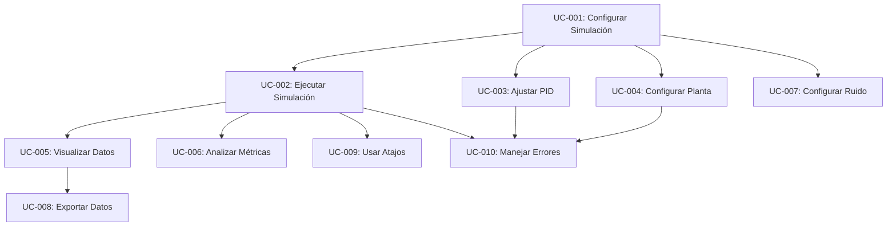

# Casos de Uso - PID-Simulator

## 📋 Resumen

Este documento describe los casos de uso principales del simulador PID, incluyendo actores, precondiciones, flujos principales y alternativos, y postcondiciones.

## 🎭 Actores

### Actor Principal: Usuario de Control
- **Descripción**: Ingeniero, técnico o estudiante que utiliza el simulador para análisis de control
- **Objetivos**: Configurar, ejecutar y analizar simulaciones PID
- **Conocimientos**: Básicos de control PID y sistemas térmicos

### Actor Secundario: Desarrollador
- **Descripción**: Programador que extiende o mantiene el simulador
- **Objetivos**: Modificar funcionalidades, agregar características
- **Conocimientos**: TypeScript, React, teoría de control

## 🔄 Casos de Uso Principales

### UC-001: Configurar Simulación Básica

**Actor**: Usuario de Control  
**Prioridad**: Alta  
**Frecuencia**: Muy alta

#### Precondiciones
- Aplicación web cargada y funcionando
- Worker de simulación inicializado
- Interfaz de usuario disponible

#### Flujo Principal
1. Usuario accede a la aplicación web
2. Sistema muestra interfaz con configuración por defecto
3. Usuario selecciona modo de operación (Horno/Chiller)
4. Usuario ajusta setpoint usando slider o input numérico
5. Usuario selecciona preset PID (Conservador/Balanceado/Agresivo)
6. Usuario selecciona preset de planta (Horno lento/medio, Chiller compacto)
7. Sistema valida parámetros en tiempo real
8. Usuario inicia simulación presionando botón "Start" o tecla "S"

#### Flujos Alternativos
- **A1**: Usuario configura parámetros manualmente en lugar de usar presets
- **A2**: Sistema detecta parámetros inválidos y muestra error
- **A3**: Usuario modifica setpoint durante simulación en curso

#### Postcondiciones
- Simulación configurada y lista para ejecutar
- Parámetros validados y aplicados
- Interfaz actualizada con nueva configuración

---

### UC-002: Ejecutar Simulación en Tiempo Real

**Actor**: Usuario de Control  
**Prioridad**: Crítica  
**Frecuencia**: Muy alta

#### Precondiciones
- Simulación configurada (UC-001)
- Worker de simulación en estado "Ready"
- Parámetros válidos

#### Flujo Principal
1. Usuario presiona botón "Start" o tecla "S"
2. Sistema envía comando START al worker
3. Worker inicia simulación a 10 Hz
4. Sistema actualiza estado a "Running"
5. Gráficas comienzan a mostrar datos en tiempo real
6. Métricas de control se calculan y actualizan
7. Usuario observa respuesta del sistema
8. Usuario puede pausar con botón "Pause" o tecla "S"

#### Flujos Alternativos
- **A1**: Worker falla al iniciar → Sistema muestra error y sugiere reset
- **A2**: Rendimiento insuficiente → Sistema reduce frecuencia automáticamente
- **A3**: Usuario modifica parámetros durante simulación → Cambios aplicados inmediatamente

#### Postcondiciones
- Simulación ejecutándose a frecuencia especificada
- Datos visualizándose en gráficas
- Métricas calculándose en tiempo real
- Estado del sistema actualizado

---

### UC-003: Ajustar Parámetros PID

**Actor**: Usuario de Control  
**Prioridad**: Alta  
**Frecuencia**: Alta

#### Precondiciones
- Simulación configurada (UC-001)
- Interfaz de control disponible

#### Flujo Principal
1. Usuario accede al panel de control PID
2. Usuario ajusta ganancia proporcional (Kp) usando slider
3. Sistema valida rango (0-100) en tiempo real
4. Usuario ajusta ganancia integral (Ki) usando slider
5. Sistema valida rango (0-10 s⁻¹) en tiempo real
6. Usuario ajusta tiempo derivativo (Kd) usando slider
7. Sistema valida rango (0-100 s) en tiempo real
8. Sistema aplica cambios al controlador PID
9. Si simulación está activa, cambios se reflejan inmediatamente

#### Flujos Alternativos
- **A1**: Usuario ingresa valor fuera de rango → Sistema muestra error y restringe entrada
- **A2**: Usuario selecciona preset → Sistema aplica valores predefinidos
- **A3**: Usuario ajusta factor N (filtro derivativo) → Sistema valida estabilidad numérica

#### Postcondiciones
- Parámetros PID actualizados
- Controlador reconfigurado
- Respuesta del sistema modificada
- Validaciones aplicadas

---

### UC-004: Configurar Planta FOPDT

**Actor**: Usuario de Control  
**Prioridad**: Alta  
**Frecuencia**: Media

#### Precondiciones
- Aplicación cargada
- Panel de configuración de planta disponible

#### Flujo Principal
1. Usuario accede al panel de configuración de planta
2. Usuario selecciona modo (Horno/Chiller)
3. Usuario ajusta ganancia K usando slider
4. Sistema valida rango (-100 a +100 °C/s)
5. Usuario ajusta constante de tiempo τ usando slider
6. Sistema valida rango (1-3600 s)
7. Usuario ajusta tiempo muerto L usando slider
8. Sistema valida rango (0-600 s)
9. Usuario ajusta temperatura ambiente T_amb
10. Sistema valida rango (-273 a +1000 °C)
11. Sistema aplica nueva configuración de planta

#### Flujos Alternativos
- **A1**: Usuario selecciona preset de planta → Sistema aplica configuración predefinida
- **A2**: Sistema detecta L > 10·τ → Muestra advertencia de inestabilidad
- **A3**: Usuario cambia modo → Sistema ajusta ganancia K automáticamente

#### Postcondiciones
- Parámetros de planta actualizados
- Modelo FOPDT reconfigurado
- Discretización recalculada
- Validaciones aplicadas

---

### UC-005: Visualizar Datos en Gráficas

**Actor**: Usuario de Control  
**Prioridad**: Alta  
**Frecuencia**: Muy alta

#### Precondiciones
- Simulación configurada y ejecutándose
- Gráficas inicializadas

#### Flujo Principal
1. Sistema muestra gráfica PV vs SP vs tiempo
2. Sistema muestra gráfica de salida del controlador
3. Datos se actualizan cada 100ms (10 Hz)
4. Usuario puede cambiar ventana de tiempo (1min/5min/30min)
5. Usuario puede hacer zoom y pan en gráficas
6. Sistema muestra métricas de control en tiempo real
7. Sistema indica estado de saturación del controlador

#### Flujos Alternativos
- **A1**: Usuario cambia ventana de tiempo → Sistema ajusta escala automáticamente
- **A2**: Datos exceden buffer → Sistema elimina datos más antiguos
- **A3**: Rendimiento bajo → Sistema reduce frecuencia de actualización

#### Postcondiciones
- Gráficas mostrando datos actualizados
- Métricas calculadas y visibles
- Interfaz responsive y fluida

---

### UC-006: Analizar Métricas de Control

**Actor**: Usuario de Control  
**Prioridad**: Media  
**Frecuencia**: Alta

#### Precondiciones
- Simulación ejecutándose con cambio de setpoint
- Métricas habilitadas

#### Flujo Principal
1. Usuario cambia setpoint para generar respuesta transitoria
2. Sistema detecta cambio de setpoint
3. Sistema inicia cálculo de métricas
4. Sistema calcula overshoot en tiempo real
5. Sistema calcula peak time cuando se alcanza máximo
6. Sistema calcula settling time cuando PV entra en banda ±5%
7. Sistema muestra métricas en panel dedicado
8. Usuario puede exportar métricas

#### Flujos Alternativos
- **A1**: No hay overshoot → Sistema indica "Sin sobreimpulso"
- **A2**: Sistema no se establece → Sistema indica "No establecido"
- **A3**: Usuario resetea simulación → Sistema limpia métricas

#### Postcondiciones
- Métricas calculadas y mostradas
- Análisis de respuesta disponible
- Datos listos para exportación

---

### UC-007: Configurar Ruido de Simulación

**Actor**: Usuario de Control  
**Prioridad**: Baja  
**Frecuencia**: Baja

#### Precondiciones
- Panel de configuración de ruido disponible

#### Flujo Principal
1. Usuario habilita simulación de ruido
2. Usuario ajusta intensidad del ruido (0-10 °C)
3. Sistema valida rango en tiempo real
4. Usuario puede configurar semilla para reproducibilidad
5. Sistema aplica ruido gaussiano a PV
6. Ruido se refleja en gráficas y métricas

#### Flujos Alternativos
- **A1**: Usuario deshabilita ruido → Sistema elimina ruido inmediatamente
- **A2**: Usuario cambia semilla → Sistema regenera secuencia de ruido
- **A3**: Intensidad muy alta → Sistema muestra advertencia

#### Postcondiciones
- Ruido configurado y aplicado
- PV con ruido simulado
- Reproducibilidad garantizada

---

### UC-008: Exportar Datos de Simulación

**Actor**: Usuario de Control  
**Prioridad**: Baja  
**Frecuencia**: Baja

#### Precondiciones
- Datos de simulación disponibles
- Función de exportación habilitada

#### Flujo Principal
1. Usuario selecciona tipo de exportación (ventana/completo)
2. Si ventana: usuario especifica duración en segundos
3. Sistema recolecta datos del buffer
4. Sistema genera archivo CSV con metadatos
5. Sistema incluye timestamp, configuración y datos
6. Sistema descarga archivo automáticamente
7. Sistema muestra confirmación de exportación

#### Flujos Alternativos
- **A1**: No hay datos → Sistema muestra mensaje de error
- **A2**: Buffer muy grande → Sistema muestra progreso
- **A3**: Error de descarga → Sistema permite reintentar

#### Postcondiciones
- Archivo CSV descargado
- Datos preservados para análisis externo
- Metadatos incluidos

---

### UC-009: Usar Atajos de Teclado

**Actor**: Usuario de Control  
**Prioridad**: Media  
**Frecuencia**: Alta

#### Precondiciones
- Aplicación enfocada
- Atajos habilitados

#### Flujo Principal
1. Usuario presiona "S" → Sistema inicia/pausa simulación
2. Usuario presiona "R" → Sistema resetea simulación
3. Usuario presiona "↑" → Sistema incrementa setpoint
4. Usuario presiona "↓" → Sistema decrementa setpoint
5. Usuario presiona "←" → Sistema reduce ventana de tiempo
6. Usuario presiona "→" → Sistema aumenta ventana de tiempo
7. Usuario presiona "Shift+↑" → Sistema incrementa setpoint en pasos de 10
8. Usuario presiona "Shift+↓" → Sistema decrementa setpoint en pasos de 10

#### Flujos Alternativos
- **A1**: Usuario está en campo de input → Atajos deshabilitados
- **A2**: Setpoint en límite → Sistema previene cambio
- **A3**: Ventana en límite → Sistema previene cambio

#### Postcondiciones
- Acción ejecutada según atajo
- Interfaz actualizada
- Feedback visual proporcionado

---

### UC-010: Manejar Errores del Sistema

**Actor**: Usuario de Control  
**Prioridad**: Alta  
**Frecuencia**: Baja

#### Precondiciones
- Sistema en estado de error o advertencia

#### Flujo Principal
1. Sistema detecta error o condición de advertencia
2. Sistema muestra mensaje de error con detalles
3. Sistema sugiere acciones correctivas
4. Usuario lee mensaje y sugerencias
5. Usuario ejecuta acción correctiva sugerida
6. Sistema valida corrección
7. Sistema reanuda operación normal

#### Flujos Alternativos
- **A1**: Error crítico → Sistema detiene simulación automáticamente
- **A2**: Error recuperable → Sistema continúa con advertencia
- **A3**: Usuario ignora error → Sistema mantiene estado de error

#### Postcondiciones
- Error manejado apropiadamente
- Sistema en estado estable
- Usuario informado de resolución

---

## 🔗 Relaciones entre Casos de Uso

## 📊 Matriz de Frecuencia vs Prioridad

| Caso de Uso | Frecuencia | Prioridad | Complejidad |
|-------------|------------|-----------|-------------|
| UC-001 | Muy Alta | Alta | Media |
| UC-002 | Muy Alta | Crítica | Alta |
| UC-003 | Alta | Alta | Media |
| UC-004 | Media | Alta | Media |
| UC-005 | Muy Alta | Alta | Baja |
| UC-006 | Alta | Media | Media |
| UC-007 | Baja | Baja | Baja |
| UC-008 | Baja | Baja | Baja |
| UC-009 | Alta | Media | Baja |
| UC-010 | Baja | Alta | Media |

---

**Versión**: 1.0.0  
**Fecha**: Diciembre 2024  
**Estado**: Implementado y validado
