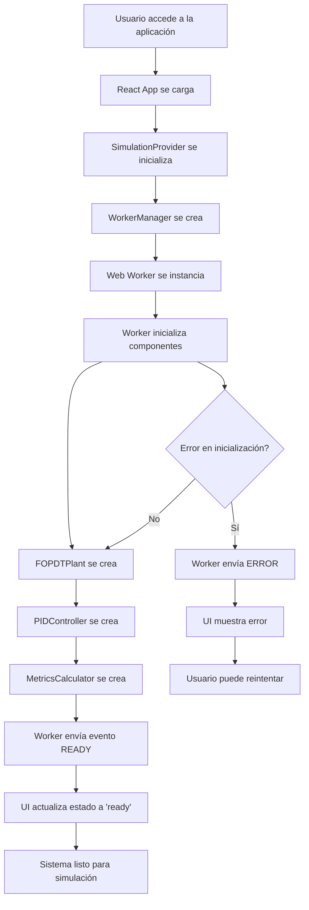
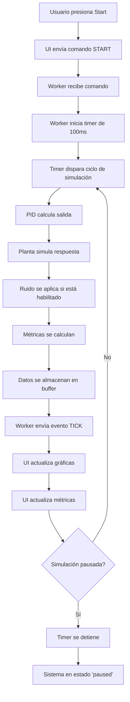
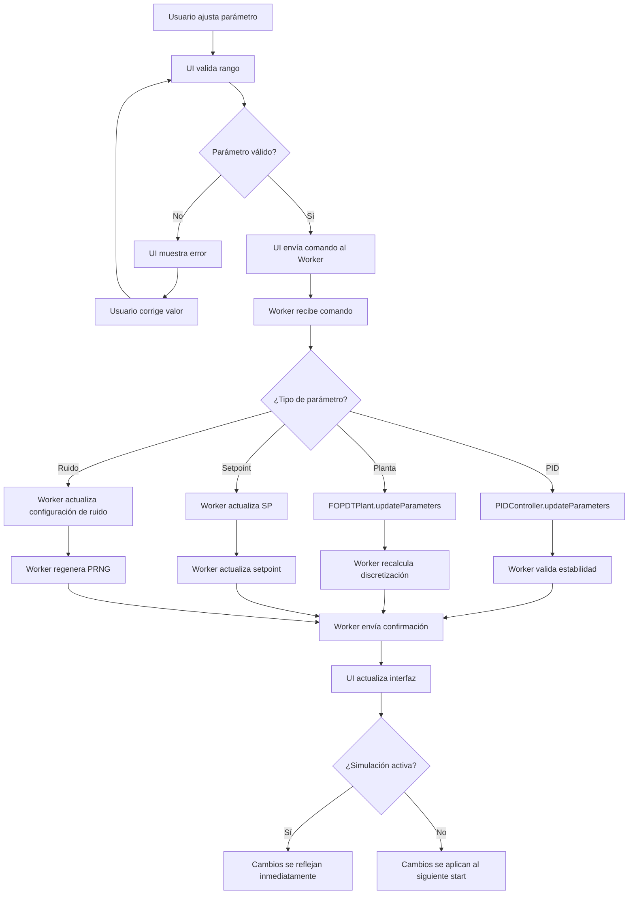
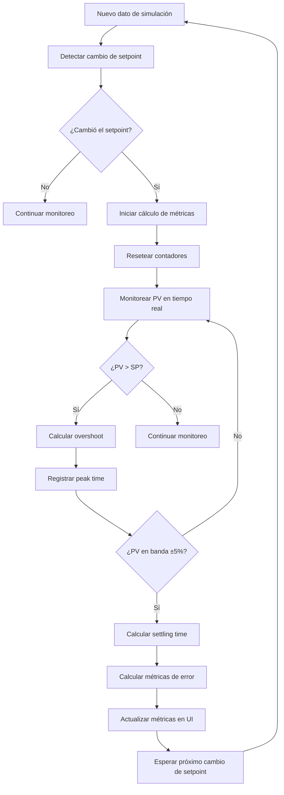
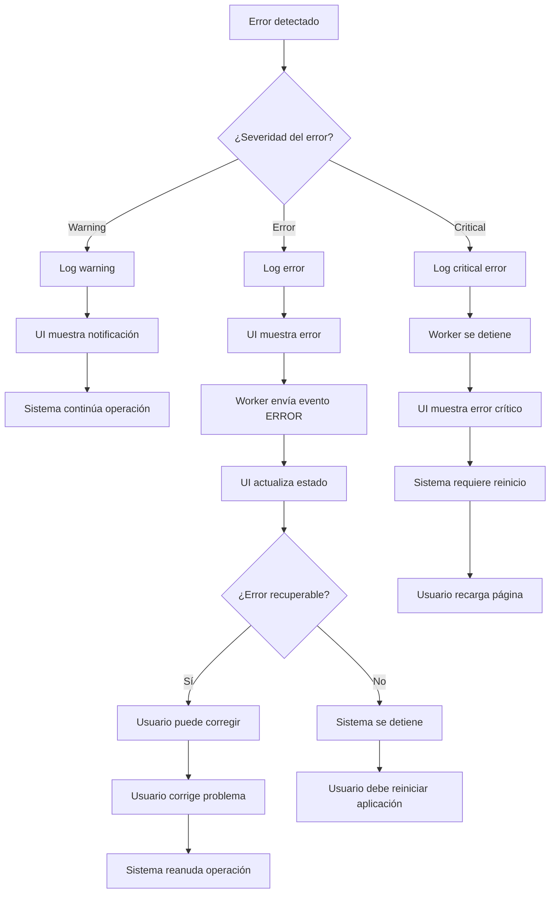
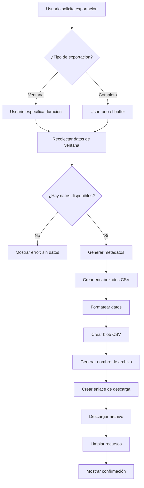
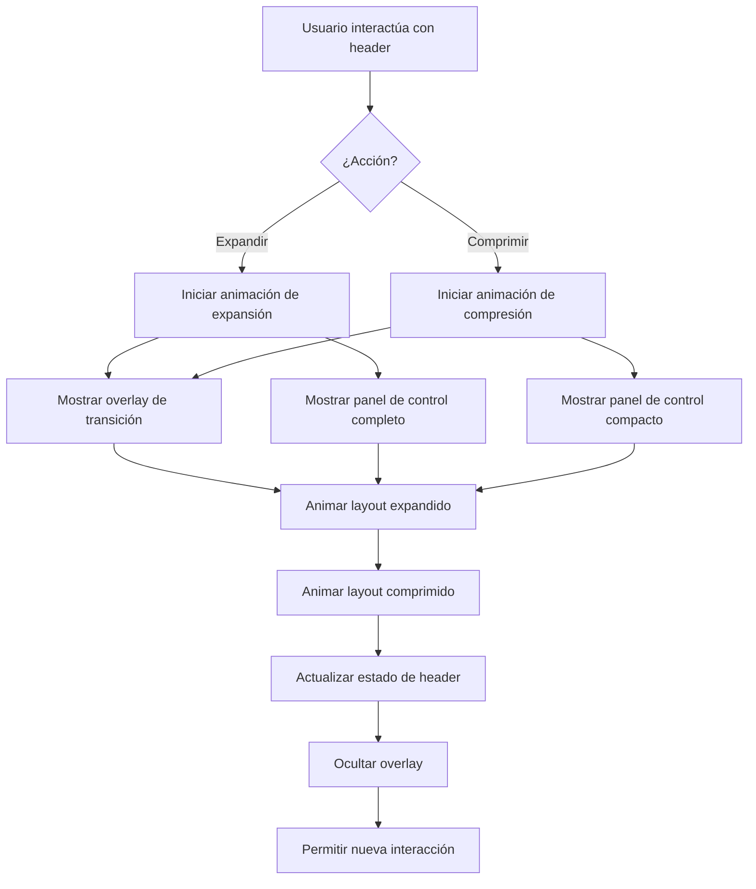
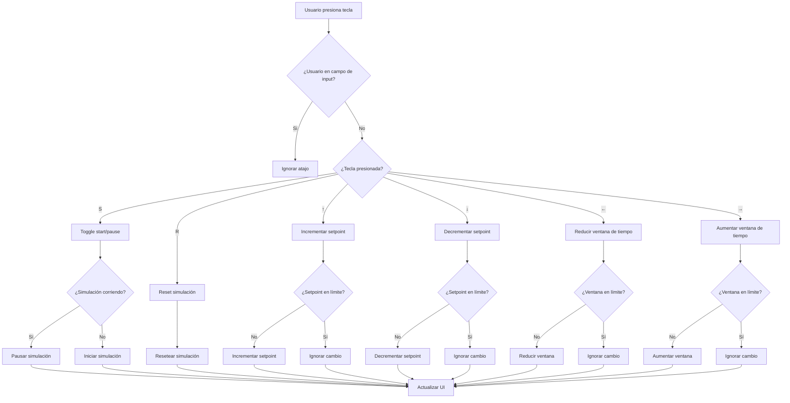
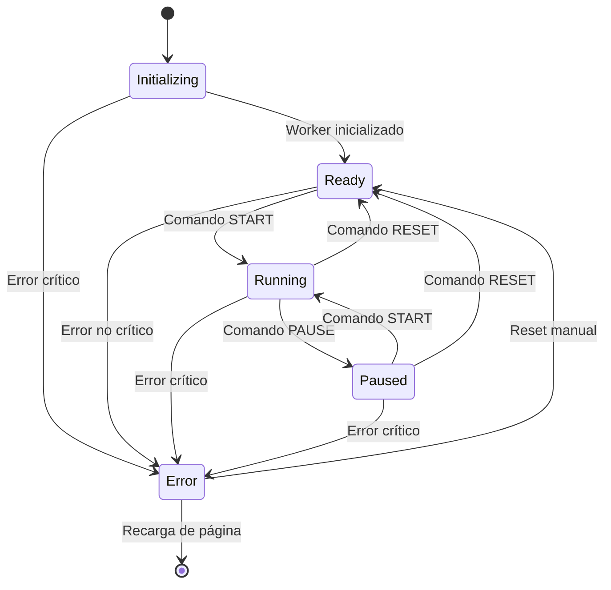
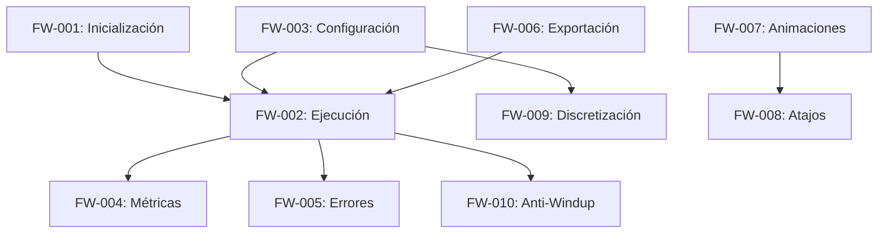

# Flujos de Trabajo - PID-Simulator

## 📋 Resumen

Este documento describe los flujos de trabajo principales del simulador PID, incluyendo diagramas de flujo detallados para los procesos más complejos del sistema.

## 🔄 Flujos de Trabajo Principales

### FW-001: Flujo de Inicialización del Sistema



### FW-002: Flujo de Ejecución de Simulación



### FW-003: Flujo de Configuración de Parámetros



### FW-004: Flujo de Cálculo de Métricas



### FW-005: Flujo de Manejo de Errores



### FW-006: Flujo de Exportación de Datos



### FW-007: Flujo de Animaciones de UI



### FW-008: Flujo de Atajos de Teclado



## 🔧 Flujos Técnicos Específicos

### FW-009: Flujo de Discretización FOPDT

```mermaid
flowchart TD
    A[Parámetros de planta cambian] --> B{¿Cambió τ o timestep?}
    B -->|No| C[No recalcular]
    B -->|Sí| D[Calcular φ = e^(-Ts/τ)]
    D --> E[Calcular γ = K * (1 - φ)]
    E --> F[Calcular muestras de tiempo muerto]
    F --> G[Redimensionar buffer si es necesario]
    G --> H[Actualizar factores de discretización]
    H --> I[Validar estabilidad numérica]
    I --> J{¿Estable?}
    J -->|No| K[Mostrar advertencia]
    J -->|Sí| L[Discretización actualizada]
    K --> L
```

### FW-010: Flujo de Anti-Windup PID

```mermaid
flowchart TD
    A[PID calcula salida] --> B[Calcular u_raw = P + I + D]
    B --> C[Saturar salida: u = clamp(u_raw, 0, 1)]
    C --> D{¿Salida saturada?}
    D -->|No| E[Retornar salida normal]
    D -->|Sí| F[Calcular error de saturación]
    F --> G[Error = u - u_raw]
    G --> H[Aplicar back-calculation]
    H --> I[Integral += (1/Tt) * Error * Ts]
    I --> J[Retornar salida saturada]
```

## 📊 Diagrama de Estados del Sistema



## 🔗 Relaciones entre Flujos



## 📈 Métricas de Flujo

### Tiempos de Respuesta Objetivo
- **Inicialización**: < 2 segundos
- **Cambio de parámetros**: < 50ms
- **Actualización de gráficas**: < 100ms
- **Cálculo de métricas**: < 10ms
- **Exportación**: < 5 segundos

### Frecuencias de Operación
- **Simulación**: 10 Hz (100ms)
- **Actualización UI**: 10 Hz
- **Cálculo métricas**: On-demand
- **Validación parámetros**: Real-time

### Capacidades de Buffer
- **Datos de simulación**: 100,000 muestras
- **Métricas**: 1,000 muestras
- **Errores**: 100 eventos
- **Performance**: 100 ciclos

---

**Versión**: 1.0.0  
**Fecha**: Diciembre 2024  
**Estado**: Implementado y validado
