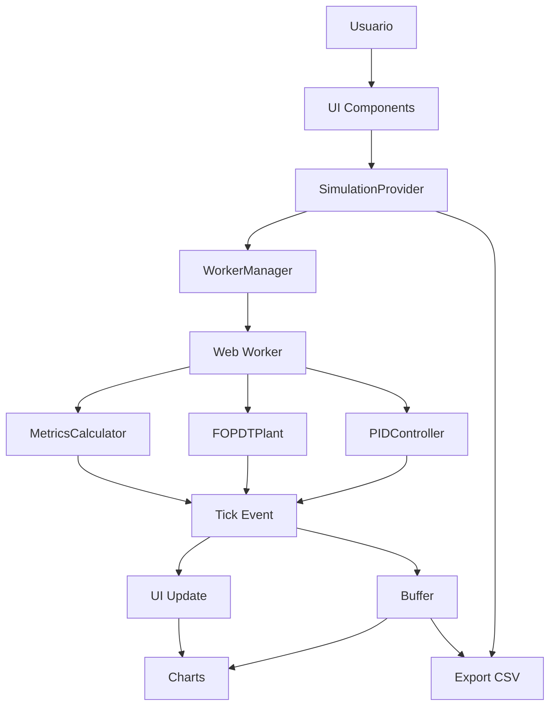

# Especificaciones de Interfaces - PID-Simulator

## 📋 Resumen

Este documento define las especificaciones de interfaces del simulador PID, incluyendo APIs públicas, formatos de datos, protocolos de comunicación y contratos de interfaz.

## 🎯 Objetivos

### Objetivo Principal
Definir claramente todas las interfaces públicas del sistema para facilitar la integración, extensión y mantenimiento del simulador PID.

## 🔌 APIs Públicas

### API de Simulación (SimulationProvider)

#### Context Interface
```typescript
interface SimulationContextValue {
  state: SimulationContextState;
  actions: SimulationContextActions;
}
```

#### State Interface
```typescript
interface SimulationContextState {
  // Estado de conexión
  isConnected: boolean;
  isInitialized: boolean;
  isRunning: boolean;
  workerState: 'initializing' | 'ready' | 'running' | 'paused' | 'error';
  
  // Datos actuales
  currentData: TickEvent['payload'] | null;
  buffer: SimulationBuffer['data'];
  
  // Métricas de rendimiento
  performance: PerformanceMetrics;
  
  // Errores
  lastError: ErrorEvent['payload'] | null;
  
  // Métricas de control
  metrics: ControlMetrics | null;
  
  // Configuración actual
  config: SimulationConfig;
}
```

#### Actions Interface
```typescript
interface SimulationContextActions {
  // Control de simulación
  start: () => Promise<void>;
  pause: () => Promise<void>;
  reset: (preserveParams?: boolean) => Promise<void>;
  
  // Configuración de parámetros
  setPID: (params: PIDParameters) => Promise<void>;
  setPlant: (params: PlantParameters) => Promise<void>;
  setSetpoint: (value: number, rampRate?: number) => Promise<void>;
  setNoise: (enabled: boolean, sigma?: number, seed?: number) => Promise<void>;
  
  // Utilidades
  getWindowData: (windowSeconds: number) => SimulationBuffer['data'];
  clearBuffer: () => void;
  clearError: () => void;
  
  // Estado del Worker
  getWorkerStatus: () => WorkerManagerStatus;
  
  // Exportación CSV
  exportCSV: (range: ExportRange) => void;
}
```

### API de Controlador PID

#### Parameters Interface
```typescript
interface PIDParameters {
  kp: number;        // Ganancia proporcional [adimensional]
  ki: number;        // Ganancia integral [s⁻¹]
  kd: number;        // Tiempo derivativo [s]
  N: number;         // Factor de filtro derivada (default: 10)
  Tt: number;        // Tiempo de tracking anti-windup [s]
  enabled: boolean;  // Habilitar/deshabilitar PID
}
```

#### Output Interface
```typescript
interface PIDOutput {
  u: number;          // Salida total [0-1]
  u_raw: number;      // Salida antes de saturar
  P_term: number;     // Término proporcional
  I_term: number;     // Término integral
  D_term: number;     // Término derivativo
  saturated: boolean; // True si la salida está saturada
}
```

### API de Planta FOPDT

#### Parameters Interface
```typescript
interface PlantParameters {
  K: number;      // Ganancia efectiva [°C/s por unidad u]
  tau: number;    // Constante de tiempo [s]
  L: number;      // Tiempo muerto [s]
  T_amb: number;  // Temperatura ambiente [°C]
  mode: 'horno' | 'chiller';  // Modo de operación
}
```

#### State Interface
```typescript
interface PlantState {
  x: number;                    // Estado interno: x = T - T_amb
  dead_time_buffer: number[];   // Buffer circular para tiempo muerto
  buffer_index: number;         // Índice actual en el buffer
}
```

## 📡 Protocolos de Comunicación

### Worker-UI Communication

#### Message Types
```typescript
type SimulationCommand = 
  | InitCommand
  | StartCommand
  | PauseCommand
  | ResetCommand
  | SetPIDCommand
  | SetPlantCommand
  | SetSPCommand
  | SetNoiseCommand;

type SimulationEvent = 
  | ReadyEvent
  | TickEvent
  | StateEvent
  | MetricsEvent
  | ErrorEvent;
```

#### Command Format
```typescript
interface SimulationCommand {
  id: string;           // UUID único
  type: CommandType;    // Tipo de comando
  timestamp: number;    // Timestamp de envío
  payload: CommandPayload;
}
```

#### Event Format
```typescript
interface SimulationEvent {
  id: string;           // UUID único
  type: EventType;      // Tipo de evento
  timestamp: number;    // Timestamp de recepción
  payload: EventPayload;
}
```

### Tick Event Payload
```typescript
interface TickEventPayload {
  t: number;           // Tiempo de simulación [s]
  SP: number;          // Setpoint [°C]
  PV: number;          // Process Variable [°C]
  u: number;           // Salida del controlador [0-1]
  PV_clean: number;    // PV sin ruido [°C]
  error: number;       // Error [°C]
  P_term: number;      // Término proporcional
  I_term: number;      // Término integral
  D_term: number;      // Término derivativo
  plant_state: number; // Estado interno de la planta
  u_raw: number;       // Salida sin saturar
  saturated: boolean;  // Estado de saturación
  bounds: DataBounds;  // Límites de la ventana
}
```

## 📊 Formatos de Datos

### Simulation Buffer
```typescript
interface SimulationBuffer {
  data: TickEventPayload[];
  maxSize: number;
  currentSize: number;
  isFull: boolean;
}
```

### Performance Metrics
```typescript
interface PerformanceMetrics {
  avg_cycle_time: number;    // ms
  max_cycle_time: number;    // ms
  cpu_usage_estimate: number; // %
  uptime: number;            // s
  samples_processed: number;
}
```

### Control Metrics
```typescript
interface ControlMetrics {
  overshoot: number;         // %
  t_peak: number;           // s
  settling_time: number;    // s
  is_calculating: boolean;
  sp_previous: number;      // °C
  pv_max: number;          // °C
  pv_min: number;          // °C
  t_start: number;         // s
  t_current: number;       // s
  samples_count: number;
}
```

### Export Range
```typescript
type ExportRange = 
  | { type: 'window'; seconds: number }
  | { type: 'all' };
```

## 🔧 Hooks Personalizados

### useSimulation
```typescript
function useSimulation(): SimulationContextValue;
```

### useSimulationData
```typescript
function useSimulationData(): {
  currentData: TickEventPayload | null;
  buffer: TickEventPayload[];
  isRunning: boolean;
  isConnected: boolean;
};
```

### useSimulationControls
```typescript
function useSimulationControls(): SimulationContextActions & {
  isConnected: boolean;
  isRunning: boolean;
  workerState: string;
};
```

### useSimulationPerformance
```typescript
function useSimulationPerformance(): {
  performance: PerformanceMetrics;
  lastError: ErrorEvent['payload'] | null;
  workerState: string;
};
```

## 📋 Contratos de Interfaz

### Component Props Interfaces

#### UnifiedControlPanel Props
```typescript
interface UnifiedControlPanelProps {
  state: SimulatorState;
  onStateChange: (updates: Partial<SimulatorState>) => void;
  onReset: () => void;
  onExportWindow: () => void;
  onExportAll: () => void;
  metrics: ControlMetrics | null;
  currentPV: number;
  compact?: boolean;
}
```

#### ChartsPanel Props
```typescript
interface ChartsPanelProps {
  data: ChartDataPoint[];
  timeWindow: TimeWindow;
  isRunning: boolean;
}
```

#### Header Props
```typescript
interface HeaderProps {
  state: SimulatorState;
  onStateChange: (updates: Partial<SimulatorState>) => void;
  onExpansionChange: (expanded: boolean) => void;
}
```

### SimulatorState Interface
```typescript
interface SimulatorState {
  mode: 'horno' | 'chiller';
  setpoint: number;
  pid: PIDConfig;
  plant: PlantConfig;
  noise: NoiseConfig;
  ssr: SSRConfig;
  timeWindow: TimeWindow;
  isRunning: boolean;
}
```

## 🔄 Flujo de Datos

### Diagrama de Flujo de Datos


### Data Flow Interfaces
```typescript
// Flujo de configuración
User Input → UI Validation → SimulationProvider → Worker → Components

// Flujo de simulación
Worker → Tick Event → Buffer → UI Update → Charts

// Flujo de exportación
Buffer → Data Processing → CSV Generation → Download
```

## 🛡️ Validación de Interfaces

### Input Validation
```typescript
interface ValidationResult {
  valid: boolean;
  errors: string[];
  warnings: string[];
}

// PID Validation
function validatePIDParameters(params: PIDParameters): ValidationResult;

// Plant Validation
function validatePlantParameters(params: PlantParameters): ValidationResult;

// General Validation
function validateValue(value: number, limits: ValueLimits): ValidationResult;
```

### Error Handling
```typescript
interface ErrorEventPayload {
  severity: 'warning' | 'error' | 'critical';
  code: string;
  message: string;
  details?: unknown;
  timestamp: number;
  recoverable: boolean;
  suggestions?: string[];
}
```

## 📈 Métricas de Interfaz

### Performance Metrics
- **Latencia de comunicación**: < 10ms
- **Tamaño de mensajes**: < 1KB por tick
- **Frecuencia de actualización**: 10 Hz
- **Buffer efficiency**: O(1) operaciones

### Reliability Metrics
- **Message delivery**: 99.9%
- **Error recovery**: < 1 segundo
- **Data integrity**: 100%
- **Interface stability**: Sin breaking changes

## 🔗 Integración Externa

### Future API Endpoints
```typescript
// REST API (futuro)
interface SimulationAPI {
  POST /api/simulation/start
  POST /api/simulation/pause
  POST /api/simulation/reset
  PUT /api/simulation/pid
  PUT /api/simulation/plant
  GET /api/simulation/status
  GET /api/simulation/data
  POST /api/simulation/export
}
```

### WebSocket Interface (futuro)
```typescript
interface WebSocketMessage {
  type: 'command' | 'event' | 'status';
  payload: unknown;
  timestamp: number;
  sessionId: string;
}
```

## 📋 Criterios de Aceptación

### Interfaces Mínimas
- ✅ APIs tipadas y documentadas
- ✅ Comunicación Worker-UI funcional
- ✅ Hooks personalizados disponibles
- ✅ Validación de datos implementada

### Interfaces Óptimas
- ✅ APIs extensibles y versionadas
- ✅ Comunicación eficiente y confiable
- ✅ Hooks especializados y optimizados
- ✅ Validación robusta y informativa

### Interfaces Futuras
- ✅ REST API para integración externa
- ✅ WebSocket para tiempo real
- ✅ Plugin system para extensiones
- ✅ API versioning y backward compatibility

---

**Versión**: 1.0.0  
**Fecha**: Diciembre 2024  
**Estado**: Implementado y validado
