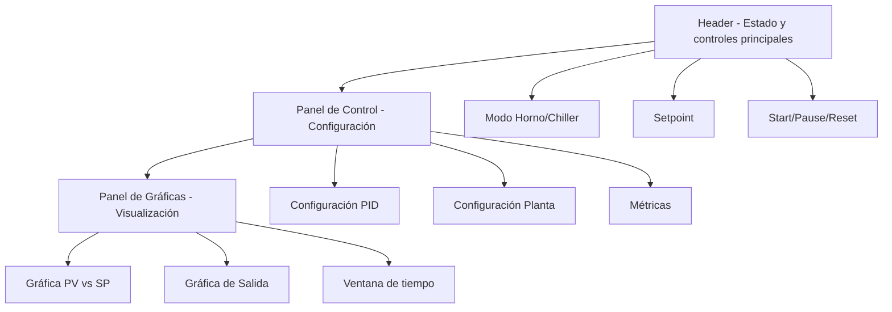
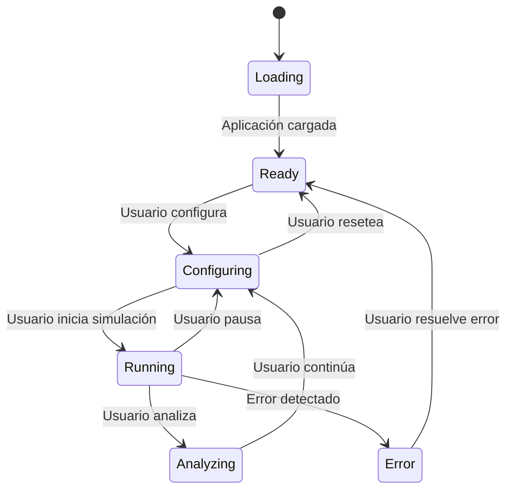

# Requisitos de Usabilidad - PID Playground

## 📋 Resumen

Este documento define los requisitos de usabilidad del simulador PID, incluyendo facilidad de uso, accesibilidad, diseño de interfaz y experiencia de usuario.

## 🎯 Objetivos de Usabilidad

### Objetivo Principal
El simulador debe ser intuitivo y fácil de usar para ingenieros, técnicos y estudiantes, proporcionando una experiencia de usuario fluida y profesional.

## 👥 Perfiles de Usuario

### Usuario Principal: Ingeniero de Control
- **Experiencia**: Conocimientos avanzados de control PID
- **Objetivos**: Análisis detallado y optimización de parámetros
- **Necesidades**: Control preciso, métricas avanzadas, exportación de datos

### Usuario Secundario: Técnico Industrial
- **Experiencia**: Conocimientos básicos de control
- **Objetivos**: Configuración y monitoreo de sistemas
- **Necesidades**: Interfaz clara, presets útiles, validación automática

### Usuario Terciario: Estudiante
- **Experiencia**: Aprendiendo control PID
- **Objetivos**: Comprensión de conceptos y experimentación
- **Necesidades**: Tutoriales, ejemplos, feedback educativo

## 🎨 Diseño de Interfaz

### Principios de Diseño
1. **Simplicidad**: Interfaz limpia y no abrumadora
2. **Consistencia**: Patrones de diseño uniformes
3. **Feedback**: Respuesta inmediata a acciones del usuario
4. **Eficiencia**: Acceso rápido a funciones principales
5. **Accesibilidad**: Usable por personas con diferentes capacidades

### Tema Visual
- **Tema principal**: Oscuro industrial
- **Colores**: Azul, naranja, verde para indicadores
- **Tipografía**: Monospace para valores técnicos
- **Iconografía**: Iconos claros y descriptivos

### Layout Responsive


## 🎛️ Controles de Usuario

### Controles Principales
- **Sliders**: Para ajuste continuo de parámetros
- **Inputs numéricos**: Para valores precisos
- **Botones**: Para acciones principales (Start, Pause, Reset)
- **Dropdowns**: Para selección de presets
- **Toggles**: Para habilitar/deshabilitar funciones

### Atajos de Teclado
```typescript
const KEYBOARD_SHORTCUTS = {
  'S': 'Start/Pause simulación',
  'R': 'Reset simulación',
  '↑': 'Incrementar setpoint',
  '↓': 'Decrementar setpoint',
  '←': 'Reducir ventana de tiempo',
  '→': 'Aumentar ventana de tiempo',
  'Shift+↑': 'Incrementar setpoint (+10)',
  'Shift+↓': 'Decrementar setpoint (-10)'
};
```

### Validación en Tiempo Real
- **Rangos de parámetros**: Validación inmediata
- **Feedback visual**: Indicadores de estado
- **Mensajes de error**: Claros y accionables
- **Sugerencias**: Valores recomendados

## 📊 Visualización de Datos

### Gráficas
- **Escala automática**: Adaptación a datos
- **Zoom y pan**: Navegación intuitiva
- **Leyendas claras**: Identificación de series
- **Colores consistentes**: PV (verde), SP (azul), Output (naranja)

### Métricas
- **Valores en tiempo real**: Actualización continua
- **Unidades claras**: °C, s, %, etc.
- **Formato legible**: Decimales apropiados
- **Indicadores de estado**: Normal, advertencia, error

### Indicadores de Estado
- **Estado de simulación**: Running, Paused, Error
- **Conexión Worker**: Connected, Disconnected
- **Validación**: Valid, Invalid, Warning
- **Performance**: Normal, Degraded, Critical

## 🎯 Experiencia de Usuario

### Flujo de Trabajo Típico
1. **Configuración inicial** (30 segundos)
   - Seleccionar modo (Horno/Chiller)
   - Ajustar setpoint
   - Seleccionar preset PID
   - Seleccionar preset planta

2. **Ejecución y monitoreo** (continuo)
   - Iniciar simulación
   - Observar respuesta
   - Ajustar parámetros si es necesario
   - Analizar métricas

3. **Análisis y exportación** (según necesidad)
   - Revisar métricas de control
   - Exportar datos
   - Documentar resultados

### Estados de Interfaz


## ♿ Accesibilidad

### Estándares de Accesibilidad
- **WCAG 2.1 AA**: Cumplimiento mínimo
- **Navegación por teclado**: Todas las funciones accesibles
- **Contraste de colores**: Ratio mínimo 4.5:1
- **Tamaño de texto**: Mínimo 16px para texto principal

### Características de Accesibilidad
- **Screen readers**: Compatibilidad con lectores de pantalla
- **Focus management**: Indicadores de foco claros
- **Error handling**: Mensajes de error accesibles
- **Keyboard navigation**: Navegación completa por teclado

### Adaptaciones
- **Zoom**: Soporte para zoom del navegador
- **High contrast**: Modo de alto contraste
- **Reduced motion**: Reducir animaciones
- **Font scaling**: Escalado de fuentes

## 📱 Responsividad

### Breakpoints
```css
/* Mobile */
@media (max-width: 768px) {
  /* Layout vertical */
  /* Controles apilados */
  /* Gráficas adaptadas */
}

/* Tablet */
@media (min-width: 769px) and (max-width: 1024px) {
  /* Layout híbrido */
  /* Controles laterales */
  /* Gráficas medianas */
}

/* Desktop */
@media (min-width: 1025px) {
  /* Layout horizontal */
  /* Controles completos */
  /* Gráficas grandes */
}
```

### Adaptaciones por Dispositivo
- **Mobile**: Interfaz simplificada, controles táctiles
- **Tablet**: Balance entre funcionalidad y usabilidad
- **Desktop**: Interfaz completa, atajos de teclado

## 🎓 Facilidad de Aprendizaje

### Curva de Aprendizaje
- **Primera vez**: < 5 minutos para simulación básica
- **Uso básico**: < 15 minutos para configuración completa
- **Uso avanzado**: < 1 hora para todas las funciones

### Ayuda y Documentación
- **Tooltips**: Información contextual
- **Help dialog**: Documentación integrada
- **Ejemplos**: Casos de uso predefinidos
- **Tutoriales**: Guías paso a paso

### Feedback Educativo
- **Validación inteligente**: Sugerencias de mejora
- **Explicaciones**: ¿Por qué no funciona?
- **Recomendaciones**: Valores típicos
- **Advertencias**: Configuraciones problemáticas

## 🔧 Personalización

### Configuración de Usuario
- **Tema**: Claro/Oscuro
- **Unidades**: Métricas/Imperial
- **Idioma**: Español/Inglés
- **Presets personalizados**: Guardar configuraciones

### Preferencias
- **Frecuencia de actualización**: Ajustable
- **Tamaño de gráficas**: Configurable
- **Métricas mostradas**: Seleccionables
- **Atajos de teclado**: Personalizables

## 📈 Métricas de Usabilidad

### Métricas Objetivas
- **Tiempo de tarea**: < 30 segundos para configuración básica
- **Tasa de error**: < 5% en tareas principales
- **Tiempo de aprendizaje**: < 15 minutos para uso básico
- **Satisfacción**: > 4.5/5 en encuestas

### Métricas Subjetivas
- **Facilidad de uso**: Evaluación heurística
- **Satisfacción**: Encuestas de usuario
- **Eficiencia**: Tiempo de completar tareas
- **Memorabilidad**: Facilidad de recordar uso

## 🎯 Criterios de Aceptación

### Usabilidad Mínima
- ✅ Interfaz intuitiva para usuarios técnicos
- ✅ Controles accesibles y responsivos
- ✅ Feedback visual claro
- ✅ Documentación básica disponible

### Usabilidad Óptima
- ✅ Interfaz profesional y moderna
- ✅ Experiencia fluida en todos los dispositivos
- ✅ Accesibilidad completa
- ✅ Personalización avanzada

### Usabilidad Educativa
- ✅ Tutoriales integrados
- ✅ Feedback educativo
- ✅ Ejemplos prácticos
- ✅ Curva de aprendizaje suave

## 🚀 Mejoras Futuras

### Corto Plazo
1. **Tutoriales interactivos**: Guías paso a paso
2. **Presets educativos**: Ejemplos de aprendizaje
3. **Modo demo**: Demostración automática
4. **Exportación mejorada**: Más formatos

### Mediano Plazo
1. **Interfaz adaptativa**: Personalización automática
2. **Modo colaborativo**: Compartir configuraciones
3. **Análisis avanzado**: Sugerencias automáticas
4. **Integración**: APIs para otros sistemas

### Largo Plazo
1. **IA asistente**: Ayuda contextual inteligente
2. **Realidad aumentada**: Visualización 3D
3. **Colaboración en tiempo real**: Múltiples usuarios
4. **Plataforma educativa**: Cursos integrados

---

**Última actualización**: Agosto 2024
**Versión**: 1.0
**Estado**: Documentación completa de requisitos de usabilidad
