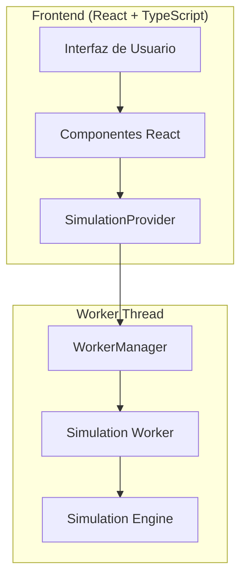

# Documentación Técnica - Simulador PID

## Visión General

Esta sección contiene toda la documentación técnica del Simulador PID, incluyendo arquitectura, APIs, guías de desarrollo y configuración de despliegue.

## Índice de Documentación

### 📋 [Arquitectura](./architecture.md)
Documentación completa de la arquitectura del sistema, incluyendo:
- Arquitectura de alto nivel
- Patrón Actor Model con Web Workers
- Componentes principales
- Flujos de datos
- Diagramas Mermaid detallados

### 🔌 [API Reference](./api-reference.md)
Referencia completa de todas las APIs públicas:
- Tipos y interfaces TypeScript
- SimulationProvider API
- WorkerManager API
- Comandos y eventos
- Hooks especializados
- Ejemplos de uso

### 🛠️ [Guía de Desarrollo](./development.md)
Guía completa para desarrolladores:
- Configuración del entorno
- Convenciones de código
- Flujo de desarrollo
- Testing
- Debugging
- Proceso de contribución

### 🚀 [Configuración y Despliegue](./deployment.md)
Guía de configuración y despliegue:
- Configuración de entorno
- Build de producción
- Configuración de servidor (Nginx, Apache)
- Despliegue automatizado
- Monitoreo y logs
- Troubleshooting

## Estructura de la Documentación

```
docs/technical/
├── README.md              # Este archivo - Índice principal
├── architecture.md        # Arquitectura del sistema
├── api-reference.md       # Referencia de APIs
├── development.md         # Guía de desarrollo
└── deployment.md          # Configuración y despliegue
```

## Uso de la Documentación

### Para Desarrolladores Nuevos

1. **Comenzar con [Arquitectura](./architecture.md)** para entender la estructura del sistema
2. **Revisar [Guía de Desarrollo](./development.md)** para configurar el entorno
3. **Consultar [API Reference](./api-reference.md)** para entender las APIs disponibles
4. **Usar [Configuración y Despliegue](./deployment.md)** para desplegar cambios

### Para Contribuidores

1. **Seguir las convenciones** en [Guía de Desarrollo](./development.md)
2. **Entender las APIs** en [API Reference](./api-reference.md)
3. **Probar cambios** usando las configuraciones en [Configuración y Despliegue](./deployment.md)

### Para Administradores de Sistema

1. **Configurar despliegue** usando [Configuración y Despliegue](./deployment.md)
2. **Monitorear performance** con las herramientas documentadas
3. **Resolver problemas** usando la sección de troubleshooting

## Diagramas y Visualizaciones

La documentación incluye diagramas Mermaid para visualizar:

- **Arquitectura del sistema** - Componentes y relaciones
- **Flujos de datos** - Secuencias de comunicación
- **Estados del Worker** - Transiciones de estado
- **Estructura de mensajes** - Contratos de comunicación

### Ejemplo de Diagrama



## Convenciones de la Documentación

### Formato de Código

- **TypeScript/JavaScript**: Bloques de código con sintaxis highlighting
- **Configuración**: Archivos de configuración con comentarios explicativos
- **Comandos**: Comandos de terminal con explicación de parámetros

### Ejemplos

Todos los ejemplos incluyen:
- Código funcional y probado
- Comentarios explicativos
- Contexto de uso
- Consideraciones de performance

### Referencias Cruzadas

La documentación usa referencias cruzadas para:
- Enlazar conceptos relacionados
- Proporcionar contexto adicional
- Evitar duplicación de información

## Mantenimiento de la Documentación

### Actualización de Documentación

1. **Sincronizar con código**: La documentación debe reflejar el estado actual del código
2. **Revisar diagramas**: Actualizar diagramas cuando cambie la arquitectura
3. **Validar ejemplos**: Probar todos los ejemplos de código
4. **Actualizar referencias**: Mantener enlaces y referencias actualizados

### Proceso de Revisión

1. **Revisión técnica**: Verificar precisión técnica
2. **Revisión de claridad**: Asegurar que sea comprensible
3. **Pruebas de ejemplos**: Validar que los ejemplos funcionen
4. **Feedback de usuarios**: Incorporar comentarios de usuarios

## Recursos Adicionales

### Documentación Relacionada

- **[Documentación de Usuario](../user-guide/)** - Guías para usuarios finales
- **[Documentación Matemática](../mathematical/)** - Fundamentos teóricos
- **[Especificaciones](../specifications/)** - Requisitos funcionales y no funcionales

### Herramientas de Desarrollo

- **TypeScript**: [Documentación oficial](https://www.typescriptlang.org/docs/)
- **React**: [Documentación oficial](https://react.dev/)
- **Vite**: [Documentación oficial](https://vitejs.dev/)
- **Web Workers**: [MDN Web Docs](https://developer.mozilla.org/en-US/docs/Web/API/Web_Workers_API)

### Estándares y Mejores Prácticas

- **Convenciones de código**: Seguir las convenciones establecidas
- **Testing**: Mantener cobertura de tests alta
- **Performance**: Monitorear métricas de performance
- **Seguridad**: Seguir mejores prácticas de seguridad

## Contribución a la Documentación

### Cómo Contribuir

1. **Identificar necesidad**: Detectar áreas que necesitan documentación
2. **Crear propuesta**: Proponer cambios o adiciones
3. **Implementar cambios**: Escribir o actualizar documentación
4. **Revisar**: Solicitar revisión de cambios
5. **Mantener**: Actualizar documentación según sea necesario

### Estándares de Calidad

- **Precisión**: Toda la información debe ser técnicamente correcta
- **Claridad**: La documentación debe ser fácil de entender
- **Completitud**: Cubrir todos los aspectos relevantes
- **Actualidad**: Mantener la documentación actualizada

## Conclusión

Esta documentación técnica proporciona una base sólida para entender, desarrollar y mantener el Simulador PID. Se actualiza regularmente para reflejar el estado actual del proyecto y las mejores prácticas de la industria.

Para preguntas específicas o sugerencias de mejora, consulta los issues del repositorio o contacta al equipo de desarrollo.

---

**Última actualización**: Agosto 2024
**Versión**: 1.0
**Estado**: Documentación completa de documentación técnica
