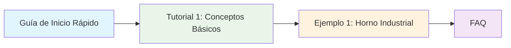
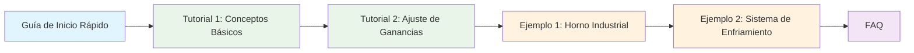

# 📖 Documentación de Usuario - Simulador PID

> **Bienvenido** a la documentación completa del simulador PID. Aquí encontrarás todo lo que necesitas para dominar el control PID.

---

## 🎯 ¿Por dónde empezar?

### 🚀 **Nuevo en PID?** 
Comienza con la [Guía de Inicio Rápido](./getting-started.md) - te llevará de 0 a tu primera simulación en 5 minutos.

### 📚 **Ya conoces los conceptos básicos?**
Salta directamente a los [Tutoriales](./tutorials/) para técnicas avanzadas de tuning.

### 🔍 **¿Tienes una pregunta específica?**
Consulta el [FAQ](./faq.md) para respuestas rápidas a las preguntas más comunes.

---

## 📋 Estructura de la Documentación

### 🚀 **Guías de Inicio**
- **[Guía de Inicio Rápido](./getting-started.md)** - Tu primera simulación en 5 minutos
  - Instalación y configuración
  - Interfaz básica explicada
  - Conceptos fundamentales de PID
  - Experimentos rápidos

### 📚 **Tutoriales**
- **[Tutorial 1: Conceptos Básicos de PID](./tutorials/01-basic-pid.md)** - Fundamentos teóricos
  - Componentes P, I, D
  - Tipos de respuesta del sistema
  - Casos de uso comunes
  - Experimentos prácticos

- **[Tutorial 2: Ajuste de Ganancias](./tutorials/02-tuning.md)** - Técnicas de tuning
  - Métodos de Ziegler-Nichols
  - Técnicas de tuning práctico
  - Criterios de optimización
  - Diagnóstico de problemas

- **[Tutorial 3: Análisis de Respuesta](./tutorials/03-response-analysis.md)** - Análisis avanzado *(En desarrollo)*
  - Métricas de rendimiento
  - Análisis de estabilidad
  - Rechazo de disturbios
  - Robustez del sistema

- **[Tutorial 4: Casos Avanzados](./tutorials/04-advanced-cases.md)** - Aplicaciones especiales *(En desarrollo)*
  - Sistemas no lineales
  - Control adaptativo
  - Optimización multi-objetivo
  - Integración con sistemas reales

### 🎮 **Ejemplos Prácticos**
- **[Ejemplo 1: Horno Industrial](./examples/01-horno-industrial.md)** - Control de temperatura
  - Configuración de sistema real
  - Proceso de tuning completo
  - Análisis de problemas
  - Configuración final optimizada

- **[Ejemplo 2: Sistema de Enfriamiento](./examples/02-chiller-system.md)** - Control de chiller *(En desarrollo)*
  - Configuración para enfriamiento
  - Tuning específico para chiller
  - Análisis de eficiencia
  - Optimización energética

- **[Ejemplo 3: Control de Velocidad](./examples/03-speed-control.md)** - Sistemas rápidos *(En desarrollo)*
  - Control de motores
  - Sistemas de bajo tiempo muerto
  - Tuning para respuesta rápida
  - Aplicaciones industriales

### ❓ **Soporte y Ayuda**
- **[FAQ](./faq.md)** - Preguntas frecuentes
  - Conceptos básicos
  - Configuración y uso
  - Problemas técnicos
  - Optimización y tuning
  - Características avanzadas
  - Solución de problemas

---

## 🎯 Rutas de Aprendizaje

### 🥇 **Ruta Básica** (2-3 horas)

**Resultado**: Comprensión sólida de PID y capacidad de configurar sistemas básicos.

### 🥈 **Ruta Intermedia** (4-6 horas)

**Resultado**: Dominio de técnicas de tuning y capacidad de optimizar sistemas complejos.

### 🥉 **Ruta Avanzada** (8-10 horas)

```mermaid
graph LR
    A[Guía de Inicio Rápido] --> B[Tutorial 1: Conceptos Básicos]
    B --> C[Tutorial 2: Ajuste de Ganancias]
    C --> D[Tutorial 3: Análisis de Respuesta]
    D --> E[Tutorial 4: Casos Avanzados]
    E --> F[Ejemplo 1: Horno Industrial]
    F --> G[Ejemplo 2: Sistema de Enfriamiento]
    G --> H[Ejemplo 3: Control de Velocidad]
    H --> I[FAQ]
    
    style A fill:#e1f5fe
    style B fill:#e8f5e8
    style C fill:#e8f5e8
    style D fill:#e8f5e8
    style E fill:#e8f5e8
    style F fill:#fff3e0
    style G fill:#fff3e0
    style H fill:#fff3e0
    style I fill:#f3e5f5
```

**Resultado**: Experto en control PID con capacidad de resolver problemas complejos.

---

## 🎮 Características del Simulador

### ✅ **Funcionalidades Principales**
- **Simulación en tiempo real** a 10Hz
- **Modelo FOPDT** con discretización exacta
- **Controlador PID** con derivada filtrada y anti-windup
- **Interfaz intuitiva** con controles deslizantes
- **Gráficas en tiempo real** de PV vs SP y salida del PID
- **Métricas automáticas** de overshoot y tiempo de establecimiento

### 🎯 **Modos de Operación**
- **Modo Horno**: Control de calentamiento (K positivo)
- **Modo Chiller**: Control de enfriamiento (K negativo)
- **Presets predefinidos**: Configuraciones optimizadas
- **Configuración manual**: Control total de parámetros

### 🔧 **Características Avanzadas**
- **Ruido simulado**: Condiciones realistas
- **Disturbios**: Paso de carga configurable
- **SSR por ventana**: Control de potencia eficiente
- **Exportación de datos**: Análisis posterior
- **Persistencia local**: Guardado de configuraciones

---

## 📊 Métricas y Análisis

### 📈 **Métricas en Tiempo Real**
- **Overshoot (%)**: Exceso sobre el setpoint
- **Tiempo de Establecimiento (s)**: Tiempo para estabilizar
- **Error Estacionario**: Diferencia permanente con el setpoint

### 📊 **Gráficas Disponibles**
- **PV vs SP**: Respuesta del sistema
- **Salida PID**: Señal de control
- **Ventana temporal**: 30s, 60s, 300s

### 🔍 **Análisis de Rendimiento**
- **Estabilidad**: Análisis de oscilaciones
- **Velocidad**: Tiempo de respuesta
- **Precisión**: Error de seguimiento
- **Robustez**: Rechazo de disturbios

---

## 🛠️ Herramientas de Soporte

### 📚 **Recursos de Aprendizaje**
- **Tutoriales paso a paso** con ejemplos prácticos
- **Casos de estudio** de aplicaciones reales
- **FAQ completo** con soluciones a problemas comunes
- **Diagramas interactivos** para visualizar conceptos

### 🔧 **Herramientas de Diagnóstico**
- **Análisis de problemas** con soluciones específicas
- **Checklists de validación** para configuraciones
- **Guías de troubleshooting** paso a paso
- **Métricas de rendimiento** para optimización

### 📞 **Soporte Técnico**
- **Documentación detallada** de todas las funcionalidades
- **Ejemplos de código** para casos avanzados
- **Comunidad de usuarios** para compartir experiencias
- **Canal de feedback** para mejoras

---

## 🎯 Casos de Uso Comunes

### 🏭 **Aplicaciones Industriales**
- **Control de temperatura** en hornos y reactores
- **Control de nivel** en tanques y silos
- **Control de velocidad** en motores y bombas
- **Control de presión** en sistemas neumáticos

### 🎓 **Aplicaciones Educativas**
- **Aprendizaje de control PID** sin hardware
- **Experimentación** con diferentes configuraciones
- **Validación de teoría** con simulación práctica
- **Desarrollo de habilidades** de tuning

### 🔬 **Aplicaciones de Investigación**
- **Prototipado rápido** de algoritmos de control
- **Análisis de rendimiento** de diferentes estrategias
- **Validación de modelos** matemáticos
- **Optimización** de parámetros de control

---

## 📈 Progreso y Evaluación

### 🎯 **Objetivos de Aprendizaje**
- **Comprensión teórica** de control PID
- **Habilidades prácticas** de tuning
- **Capacidad de análisis** de respuestas del sistema
- **Aplicación a casos reales**

### 📊 **Indicadores de Progreso**
- **Configuración exitosa** de sistemas básicos
- **Tuning efectivo** de controladores PID
- **Análisis correcto** de problemas de control
- **Optimización** de parámetros para casos específicos

### 🏆 **Certificación de Habilidades**
- **Nivel Básico**: Configuración y uso del simulador
- **Nivel Intermedio**: Tuning y optimización
- **Nivel Avanzado**: Análisis y resolución de problemas complejos

---

## 🔄 Actualizaciones y Mejoras

### 📅 **Cronograma de Actualizaciones**
- **Correcciones de bugs**: Semanal
- **Nuevas funcionalidades**: Mensual
- **Mejoras de documentación**: Continua
- **Nuevos ejemplos**: Trimestral

### 🎯 **Próximas Funcionalidades**
- **Control adaptativo** automático
- **Análisis de estabilidad** avanzado
- **Optimización multi-objetivo**
- **Integración con hardware real**

### 📝 **Contribuciones**
- **Reporte de bugs** y sugerencias
- **Nuevos ejemplos** y casos de uso
- **Mejoras de documentación**
- **Desarrollo de funcionalidades**

---

## 📞 Contacto y Soporte

### 🆘 **¿Necesitas ayuda?**
- **FAQ**: Primera opción para preguntas comunes
- **Tutoriales**: Guías paso a paso detalladas
- **Ejemplos**: Casos prácticos de referencia
- **Comunidad**: Foro de usuarios y desarrolladores

### 📧 **Contacto Directo**
- **Issues de GitHub**: Para reportar bugs
- **Email**: Para consultas técnicas
- **Discord/Slack**: Para discusiones en tiempo real

### 📚 **Recursos Adicionales**
- **Libros recomendados** sobre control PID
- **Cursos online** de control automático
- **Papers académicos** sobre tuning PID
- **Estándares industriales** de control

---

## 🎉 ¡Comienza tu Viaje!

### 🚀 **Paso 1**: [Guía de Inicio Rápido](./getting-started.md)
Comienza aquí para tu primera simulación en 5 minutos.

### 📚 **Paso 2**: [Tutoriales](./tutorials/)
Profundiza en los conceptos y técnicas de control PID.

### 🎮 **Paso 3**: [Ejemplos Prácticos](./examples/)
Aplica lo aprendido a casos reales.

### ❓ **Paso 4**: [FAQ](./faq.md)
Resuelve dudas específicas y problemas comunes.

---

**¡Bienvenido al fascinante mundo del control PID!** 🎯

*Esta documentación está diseñada para acompañarte en tu aprendizaje, desde los conceptos más básicos hasta las aplicaciones más avanzadas del control automático.*
