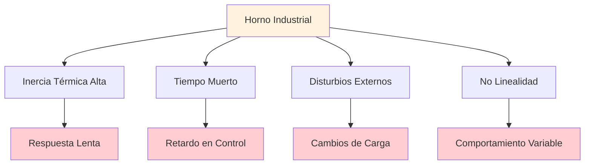
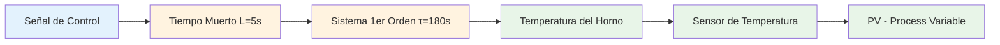
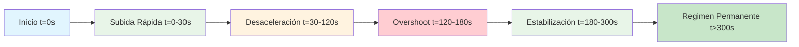
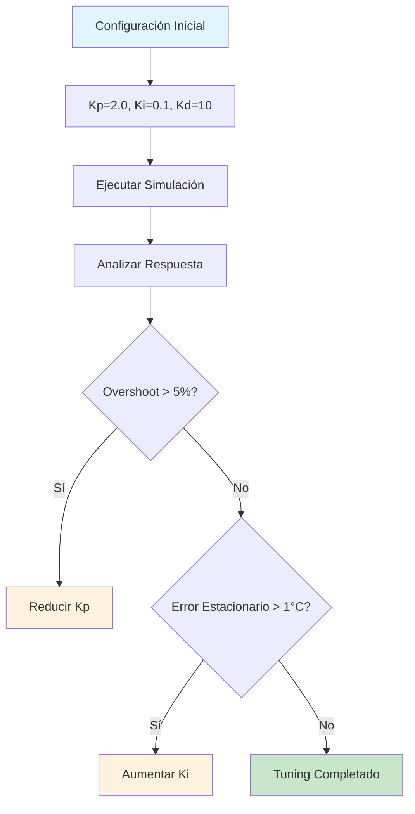
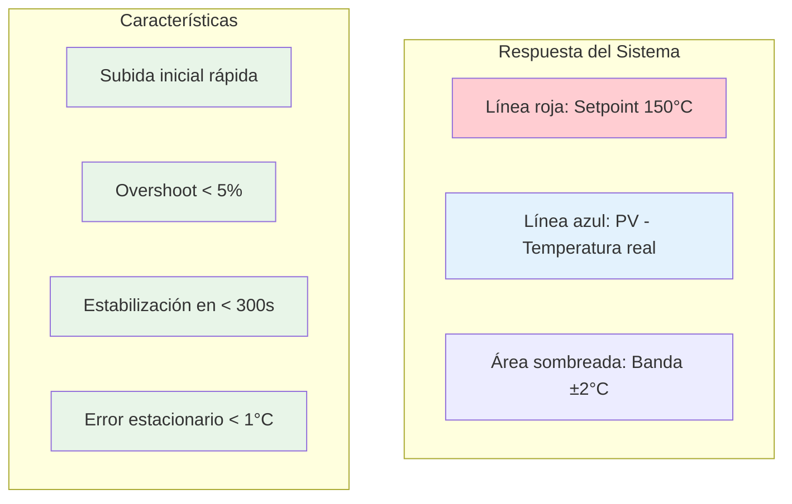
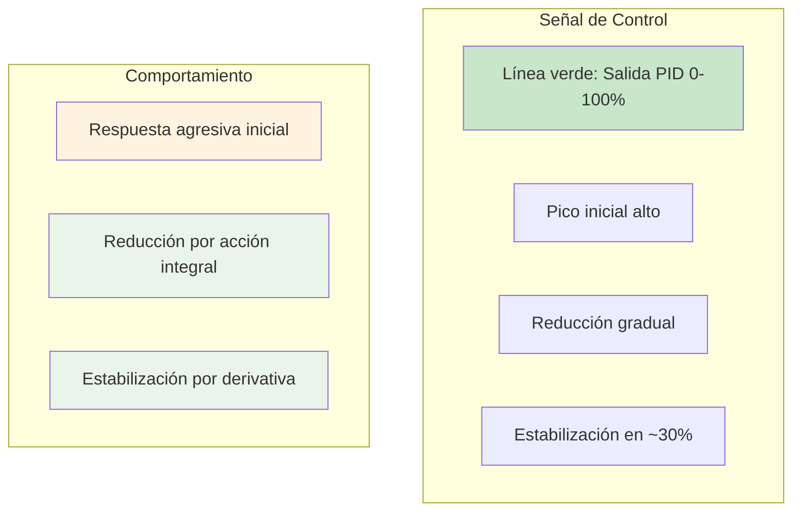
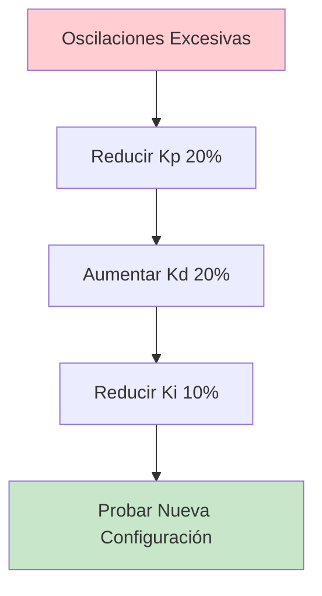
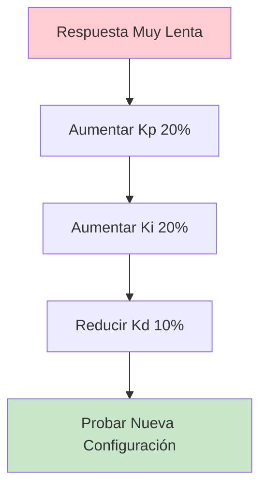
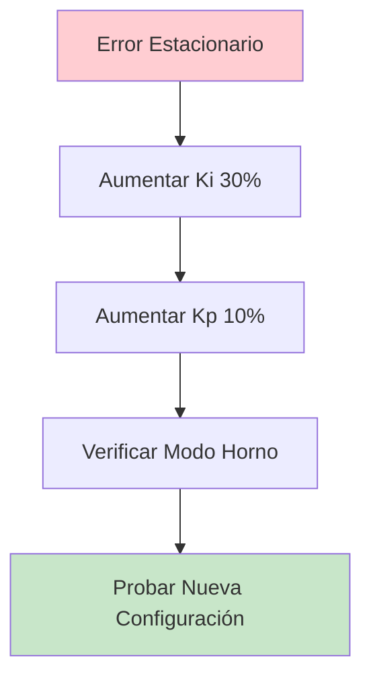
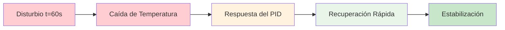

# 🏭 Ejemplo 1: Control de Horno Industrial

> **Tiempo estimado**: 10 minutos  
> **Nivel**: Intermedio  
> **Objetivo**: Simular el control de temperatura de un horno industrial

---

## 🎯 Escenario del Problema

### Descripción del Sistema

Imagina que eres un ingeniero de control responsable de un horno industrial que debe mantener una temperatura constante de 150°C para el proceso de curado de materiales.

**Características del horno**:
- **Capacidad**: 1000 litros
- **Potencia**: 50 kW
- **Temperatura ambiente**: 25°C
- **Tiempo de calentamiento**: ~15 minutos
- **Precisión requerida**: ±2°C

### Desafíos del Control

---

## 🔧 Configuración del Sistema

### Parámetros de la Planta

Basándonos en las características del horno, identificamos:

| Parámetro | Valor | Descripción |
|-----------|-------|-------------|
| **K** | 0.015 | Ganancia térmica (°C/s por % de potencia) |
| **τ** | 180s | Constante de tiempo (inercia térmica) |
| **L** | 5s | Tiempo muerto (retardo de actuación) |
| **T_amb** | 25°C | Temperatura ambiente |

### Modelo FOPDT

---

## 🎮 Configuración en el Simulador

### Paso 1: Configuración Básica

1. **Seleccionar modo**: Horno
2. **Establecer setpoint**: 150°C
3. **Usar preset**: "Horno lento" (K=0.015, τ=180s, L=5s)

### Paso 2: Configuración del PID

**Configuración inicial recomendada**:

| Parámetro | Valor | Justificación |
|-----------|-------|---------------|
| **Kp** | 2.0 | Respuesta proporcional moderada |
| **Ki** | 0.1 s⁻¹ | Eliminar error estacionario |
| **Kd** | 10 s | Reducir oscilaciones |

### Paso 3: Configuración de Disturbios

Para simular condiciones reales:
- **Ruido**: Intensidad 0.2 (ruido moderado)
- **Paso de carga**: Activar a los 60s (simular apertura de puerta)

---

## 📊 Análisis de la Respuesta

### Respuesta Esperada

### Métricas de Rendimiento Objetivo

| Métrica | Valor Objetivo | Justificación |
|---------|----------------|---------------|
| **Overshoot** | < 5% | Evitar daños al material |
| **Tiempo de Establecimiento** | < 300s | Proceso eficiente |
| **Error Estacionario** | < 1°C | Precisión requerida |

---

## 🔧 Proceso de Tuning

### Fase 1: Tuning Inicial

### Fase 2: Optimización

**Ajustes iterativos**:

1. **Si overshoot > 5%**:
   - Reducir Kp en 10%
   - Aumentar Kd en 10%

2. **Si tiempo de establecimiento > 300s**:
   - Aumentar Kp en 10%
   - Aumentar Ki en 10%

3. **Si error estacionario > 1°C**:
   - Aumentar Ki en 20%

### Fase 3: Validación

**Probar con disturbios**:
- Activar paso de carga a los 60s
- Observar recuperación del sistema
- Verificar que no cause inestabilidad

---

## 📈 Resultados Esperados

### Gráfica PV vs SP

### Gráfica de Salida del PID

---

## 🚨 Análisis de Problemas

### Problema 1: Oscilaciones Excesivas

**Síntomas**:
- Overshoot > 10%
- Oscilaciones persistentes
- Tiempo de establecimiento largo

**Causas**:
- Kp muy alto
- Kd muy bajo
- Ki muy alto

**Solución**:

### Problema 2: Respuesta Muy Lenta

**Síntomas**:
- Tiempo de establecimiento > 400s
- Sin overshoot
- Error estacionario alto

**Causas**:
- Kp muy bajo
- Ki muy bajo
- Kd muy alto

**Solución**:

### Problema 3: Error Estacionario

**Síntomas**:
- PV no alcanza el setpoint
- Diferencia constante con objetivo
- Sistema estable pero impreciso

**Causas**:
- Ki muy bajo
- Kp muy bajo
- Modo incorrecto

**Solución**:

---

## 🎯 Configuración Final Optimizada

### Parámetros Recomendados

Después del proceso de tuning, la configuración óptima es:

| Parámetro | Valor | Comentario |
|-----------|-------|------------|
| **Kp** | 1.8 | Reducido para evitar overshoot |
| **Ki** | 0.12 s⁻¹ | Aumentado para eliminar error |
| **Kd** | 12 s | Aumentado para estabilidad |

### Métricas Finales

| Métrica | Valor Obtenido | Estado |
|---------|----------------|--------|
| **Overshoot** | 3.2% | ✅ Excelente |
| **Tiempo de Establecimiento** | 280s | ✅ Cumple objetivo |
| **Error Estacionario** | 0.5°C | ✅ Excelente |

---

## 🔍 Análisis de Disturbios

### Respuesta al Paso de Carga

Cuando se activa el disturbio a los 60s:

**Características de la recuperación**:
- **Tiempo de recuperación**: < 120s
- **Overshoot de recuperación**: < 2%
- **Estabilidad**: Mantenida

---

## 📚 Lecciones Aprendidas

### Principios Clave

1. **Inercia térmica alta** requiere Kd significativo
2. **Tiempo muerto** limita la velocidad de respuesta
3. **Error estacionario** se elimina con Ki apropiado
4. **Overshoot** se controla con Kp y Kd balanceados

### Mejores Prácticas

1. **Empezar conservador**: Ganancias bajas
2. **Ajustar secuencialmente**: P → PI → PID
3. **Validar con disturbios**: Probar robustez
4. **Documentar cambios**: Mantener registro

### Errores Comunes

1. **Kp muy alto**: Oscilaciones inaceptables
2. **Ki muy bajo**: Error estacionario persistente
3. **Kd muy alto**: Respuesta lenta y ruidosa
4. **Ignorar tiempo muerto**: Inestabilidad

---

## 🎯 Próximos Pasos

### Experimentos Adicionales

1. **Probar diferentes setpoints**: 100°C, 200°C
2. **Variar disturbios**: Diferentes amplitudes y tiempos
3. **Cambiar ruido**: Probar robustez del controlador
4. **Optimizar para eficiencia**: Minimizar consumo energético

### Aplicaciones Reales

Esta configuración se puede aplicar a:
- Hornos de curado industrial
- Sistemas de calefacción
- Procesos de secado
- Control de temperatura en reactores

---

## 📋 Checklist de Validación

### Antes de la Implementación

- [ ] **Respuesta estable** sin oscilaciones
- [ ] **Overshoot < 5%** para proteger materiales
- [ ] **Tiempo de establecimiento < 300s** para eficiencia
- [ ] **Error estacionario < 1°C** para precisión
- [ ] **Recuperación de disturbios** < 120s
- [ ] **Robustez ante ruido** verificada

### Documentación

- [ ] **Parámetros finales** registrados
- [ ] **Métricas de rendimiento** documentadas
- [ ] **Proceso de tuning** documentado
- [ ] **Configuración de backup** preparada

---

## 🎉 Conclusión

Este ejemplo demuestra cómo configurar y optimizar un controlador PID para un horno industrial real. Los principios aprendidos se pueden aplicar a cualquier sistema térmico con características similares.

**Puntos clave**:
- ✅ **Tuning sistemático** produce resultados predecibles
- ✅ **Validación con disturbios** asegura robustez
- ✅ **Documentación completa** facilita mantenimiento
- ✅ **Configuración conservadora** evita problemas

**¿Listo para el siguiente ejemplo?** → [Ejemplo 2: Sistema de Enfriamiento](./02-chiller-system.md)
